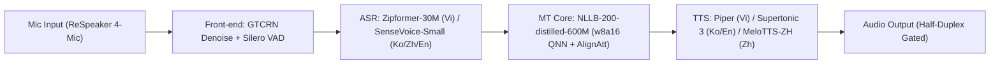

# AuraTranslate Edge — Offline NPU-Native Speech-to-Speech Translation Device

**AuraTranslate Edge** là thiết bị phiên dịch giọng nói hai chiều (Speech-to-Speech Translation) hoạt động **100% offline, NPU-native** trên nền tảng **Qualcomm Dragonwing IQ-9075 EVK** (SoC Qualcomm Hexagon NPU v73, lên tới 100 dense TOPS). Hệ thống kết nối chuỗi xử lý **Audio Front-end → ASR → MT → TTS** cho 4 ngôn ngữ: **Tiếng Việt (VI) ⇄ Tiếng Hàn (KO) / Tiếng Trung (ZH) / Tiếng Anh (EN)**, được thiết kế chuyên biệt cho môi trường công nghiệp có độ ồn cao (70–95 dB SPL) như các nhà máy FDI, công trường xây dựng, và trung tâm logistics tại Việt Nam.

Dự án được xây dựng bởi đội thi **Gia Sư Đỉnh Cao** cho cuộc thi **OneVoice AI Challenge 2026** (Saigon AI Hub × Qualcomm).

---

## 1. Điểm đột phá kỹ thuật cốt lõi (Key Technical Differentiators)

1. **100% Offline & NPU-Native (0.0% CPU Fallback):**
   - Thay vì chuyển đổi một ứng dụng điện thoại chạy ngốn pin trên CPU/GPU, AuraTranslate Edge được **đồng thiết kế (co-design) trực tiếp theo kiến trúc phần cứng NPU Qualcomm**: loại bỏ luồng điều khiển động, cố định kích thước tensor (static shapes), biên dịch thành các file nhị phân **QNN Context Binary (`.bin`)** chạy hoàn toàn trên Hexagon NPU.
   - Đã kiểm chứng thực nghiệm trên chip thật: **0.0% CPU fallback** ở các chặng đo kiểm.
2. **Công thức lượng tử hoá lai w8a16 (W8A16 Mixed Precision):**
   - Khắc phục triệt để hiện tượng vỡ âm, méo tiếng kim loại của chuẩn INT8 thông thường trên các bộ tổng hợp âm thanh (vocoder) và suy giảm thanh điệu tiếng Việt/tiếng Trung.
   - Trọng số 8-bit (INT8 weights) giúp tối ưu dung lượng bộ nhớ, trong khi kích hoạt 16-bit (INT16 activations) bảo toàn độ phân giải âm học và ngữ nghĩa ngôn ngữ.
   - **Đo kiểm độ chính xác trên phần cứng thật (Hardware-Verified vs FP32):**
     - **NLLB-200 Encoder:** Đạt **0.9998 cosine similarity** so với FP32 trên Dragonwing IQ-9075 EVK.
     - **MeloTTS-ZH NPU:** Đạt RTF **0.063** trên NPU Qualcomm.
3. **Độ trễ thời gian thực cấp độ phần cứng (Ultra-Low Latency):**
   - Text-to-Speech Time-to-First-Byte (TTFB) < 40 ms; toàn bộ pipeline hướng tới độ trễ < 1.5s cho câu ngắn.
4. **Bảo mật tuyệt đối & Không chi phí định kỳ:**
   - Dữ liệu âm thanh được xử lý hoàn toàn trong bộ nhớ đệm (in-memory), không lưu trữ bền vững, không gửi dữ liệu ra máy chủ đám mây, tuân thủ nghiêm ngặt chính sách bảo mật IP của các nhà máy sản xuất.

---

## 2. Nền tảng phần cứng đã chọn (Hardware Platform Selection)

Dựa trên kết quả thực nghiệm tại **Section 5 (Hardware & Device Concept)** của Technical Proposal:

| Tiêu chí | Phương án A — Rubik Pi 3 (QCS6490)<br>*(Ứng viên ban đầu / Đã thay thế)* | Phương án B — Dragonwing IQ-9075 EVK<br>*(CHỌN CHÍNH THỨC / SELECTED)* |
|---|---|---|
| **Hiệu năng NPU** | 12 TOPS (Hexagon NPU thế hệ v68) | **100 dense TOPS** (Qualcomm Hexagon NPU thế hệ **v73**) |
| **Khả năng biên dịch w8a16** | ❌ **Không hỗ trợ** (Hexagon v68 không biên dịch được công thức w8a16 yêu cầu) | ✅ **Hỗ trợ đầy đủ & đã verify thành công 100%** qua Qualcomm QNN SDK |
| **Bộ nhớ RAM / Bộ nhớ trong** | 8 GB LPDDR4x + 128 GB UFS | **36 GB LPDDR5** + 128 GB UFS (dư dả cho pipeline đa mô hình) |
| **Công suất tiêu thụ (TDP)** | Cần nguồn 12V / 3A (36W) | SoC: **3.8 – 20 W**; Công suất toàn hệ thống: **~5.8 – 8.8 W** |
| **Thời lượng pin dự tính** | Yêu cầu nguồn ngoài, không có pin | Đạt **> 8 giờ hoạt động liên tục** với pin 6,000 mAh Li-Po |
| **Cảm biến âm thanh** | ReSpeaker 4-Mic Array | **ReSpeaker 4-Mic Array** (AC108 ADC, 4 micro MEMS analog, MVDR beamforming) |
| **Kết luận thẩm định** | **LOẠI BỎ / REPLACED** | **CHỌN CHÍNH THỨC (SELECTED)** |

> [!IMPORTANT]
> **Lý do thay đổi nền tảng phần cứng:** Nhóm ban đầu khảo sát Rubik Pi 3 (QCS6490) nhờ giá thành và kích thước nhỏ. Tuy nhiên, quá trình kiểm tra phần cứng cho thấy NPU Hexagon v68 của QCS6490 **không thể biên dịch được công thức lượng tử hoá lai w8a16**. Nhóm đã chính thức chuyển sang nền tảng **Dragonwing IQ-9075 EVK** với kiến trúc Hexagon v73+ hỗ trợ trọn vẹn w8a16, cung cấp tới 100 dense TOPS và 36 GB LPDDR5.

---

## 3. Kiến trúc AI & Bảng mô hình theo từng chặng (Module Pipeline)

### Các bước thực hiện

| Step | Module | Mô hình / Kỹ thuật đã chọn | Tài liệu nghiên cứu | Thư mục mã nguồn |
|:---:|---|---|:---:|:---:|
| **0** | **Audio Front-end** | Silero VAD + GTCRN + MVDR Beamforming | [`docs/step0.md`](docs/step0.md) | [`src/step0_frontend/`](src/step0_frontend/) |
| **1** | **ASR (Speech Recognition)** | Zipformer-30M (Vi) + SenseVoice-Small (En/Zh/Ko) | [`docs/step1.md`](docs/step1.md) | [`src/step1_asr/`](src/step1_asr/) |
| **2** | **MT (Machine Translation)** | NLLB-200-distilled-600M INT8 (CTranslate2) | [`docs/step2.md`](docs/step2.md) | [`src/step2_mt/`](src/step2_mt/) |
| **3** | **TTS (Speech Synthesis)** | Piper (Vi) + Supertonic 3 (Ko/En) + MeloTTS-ZH (Zh) | [`docs/step3.md`](docs/step3.md) | [`src/step3_tts/`](src/step3_tts/) |
| **4** | **Hardware & Quantization** | Dragonwing IQ-9075 EVK (Hexagon v73), W8A16 Mixed Precision | [`docs/step4.md`](docs/step4.md) | [`src/step4_quantization/`](src/step4_quantization/) |
| **5** | **End-to-End Pipeline** | S2S Toàn trình: Audio In → ASR → MT → TTS → Audio Out | [`src/step5_pipeline/README.md`](src/step5_pipeline/README.md) | [`src/step5_pipeline/`](src/step5_pipeline/) |



### Bảng chi tiết thông số từng mô-đun

| Chặng | Mô-đun | Mô hình đã chọn | Kích thước / Tham số | Latency Target / Thực đo | Kỹ thuật cốt lõi & Tối ưu hoá NPU |
|:---:|---|---|---|---|---|
| **0** | **Audio Front-end** | **GTCRN** (ICASSP 2024) + **Silero VAD** | ~10 MB (~24K params GTCRN) | RTF < 0.1 (real-time) | Khử ồn máy móc nhà máy (70–95 dB SPL) thời gian thực + lọc bỏ khoảng lặng (silence gating), tránh lãng phí chu kỳ NPU |
| **1** | **ASR (Tiếng Việt)** | **Zipformer-30M (RNN-T → CTC Fine-tuned)** | **~85 MB** (21.4M params, FP16) | **Target < 300 ms** (Encoder Cosine Sim: 0.841, WER: 0.0615 w8a16) | Thay thế hoàn toàn decoder/joiner tuần tự bằng **1 CTC head đơn (single-shot non-autoregressive)**; fine-tune 3 giai đoạn trên **ViMD** (102.5h, 63 phương ngữ tỉnh thành); w8a16 QNN Context Binary |
| **1** | **ASR (Hàn / Trung / Anh)** | **SenseVoice-Small** (Alibaba FunASR) | **~250 MB** | **Target < 500 ms** (Đo thật trên Dragonwing IQ-9075: **182.5 ms / 29s audio**, RAM **11.08 MB**) | Kiến trúc non-autoregressive; tích hợp sẵn LID và ITN; **Single Static DAG W8A16 100.00% NPU offload** (2,984/2,984 ops NPU, 0% CPU fallback); Zero-CPU UTF-8 Detokenizer |
| **2** | **Dịch máy (MT)** | **NLLB-200-distilled-600M** (Meta AI) | **~600 MB** (CTranslate2 INT8: 594 MB) | **Target < 800 ms** (Encoder Cosine Sim: **0.9998** vs FP32 trên phần cứng thật) | Một mô hình duy nhất phủ trọn 6 chiều dịch (VI ⇄ KO, VI ⇄ ZH, VI ⇄ EN); w8a16 QNN Context Binary; tích hợp chính sách streaming **AlignAtt** (Interspeech 2023) phát từ sớm dựa trên ma trận attention |
| **3** | **TTS (Tiếng Việt)** | **Piper** (`vi_VN-vais1000-medium`) | **61 MB** (VITS ONNX) | RTF **0.144** (CPU) | VITS one-shot decoder; **nhẹ hơn 8× và nhanh hơn 3.3×** so với VieNeu-TTS; loại bỏ hoàn toàn lỗi lặp từ của Supertonic trên tiếng Việt |
| **3** | **TTS (Hàn & Anh)** | **Supertonic 3** (Flow-Matching) | **178 MB** (nén mixed-INT8 từ 398 MB) | RTF **1.11** (Ko) / **1.16** (En) | Flow-matching TTS; **Mixed-INT8** (giữ riêng `vocoder.onnx` FP32 chống vỡ tiếng, 3 submodels còn lại INT8); tích hợp **Quality-Gated Retry** (tối đa 5 lần) bằng SenseVoice chống lỗi lặp âm tiếng Hàn |
| **3** | **TTS (Tiếng Trung)** | **MeloTTS-ZH** | **199 MB** | RTF **0.063** (Đo thật trên NPU Snapdragon) | Pre-quantized HTP NPU trên Qualcomm AI Hub, w8a16 QNN Context Binary; `disable_bert=True` trong pipeline |
| **4** | **Lượng tử hoá & NPU** | **W8A16 Mixed Precision + QNN** | **~1.38 GB** (Toàn bộ pipeline) | **0.0% CPU Fallback**, 100% NPU offload | Lượng tử hoá lai trọng số INT8 và kích hoạt INT16; QNN Context Binary `.bin` chạy trên Hexagon NPU v73; sửa lỗi vỡ tiếng vocoder và bảo toàn thanh điệu |
| **5** | **Pipeline Toàn trình** | **Unified S2S Pipeline** | Tích hợp trọn bộ 5 mô-đun | **Target < 1.5s**, thực đo CUDA ~0.74s / CPU ~2.5s | Ghép nối toàn chuỗi ASR → MT → TTS; tự động sửa lỗi ALL-CAPS tiếng Việt; cơ chế Quality-gated retry cho tiếng Hàn; tắt BERT prosody MeloTTS |

---

## 4. Ngân sách tài nguyên & Quản lý bộ nhớ (Memory & Power Budget)

- **Tổng dung lượng mô hình trên ổ đĩa (128 GB UFS):** Toàn bộ pipeline lượng tử hoá chiếm khoảng **~1.30 – 1.38 GB**, tải tức thì lúc khởi động dưới dạng QNN Context Binaries.
- **Mức chiếm dụng RAM NPU (36 GB LPDDR5):**
  - Đỉnh RAM hoạt động của SenseVoice-Small E2E đo thực tế trên phần cứng NPU: **~11.08 MB**.
  - Headroom bộ nhớ cực kỳ dồi dào trên Dragonwing IQ-9075 EVK, loại bỏ nguy cơ tràn RAM (OOM) khi chạy đồng thời nhiều mô hình.
  - Cơ chế **Lazy Loading** và giải phóng định kỳ bộ đệm ngữ cảnh (past-context flushing) chống rò rỉ bộ nhớ trong các phiên làm việc kéo dài trọn ca sản xuất (> 8 tiếng).
- **Tổng công suất tiêu thụ toàn hệ thống:** **~5.8 – 8.8 W** (Bao gồm SoC 3.8–20W, ReSpeaker Mic 0.1W, Loa 0.5W, UFS Storage 0.2W), vận hành êm ái với tản nhiệt thụ động (fanless passive cooling).

---

## 5. Xử lý thách thức môi trường biên (Robustness & Edge Cases)

1. **Chống nhiễu công nghiệp (Acoustic Noise 70–95 dB SPL):** Chặng tiền xử lý GTCRN triệt tiêu tạp âm máy móc trước khi đưa vào ASR, kết hợp tăng cường dữ liệu nhiễu trong tập huấn luyện của Zipformer.
2. **Loại bỏ vòng lặp vọng âm (Echo Prevention):** Cơ chế giao tiếp bán song công (half-duplex turn-based): tự động ngắt micro (mute) trong lúc loa TTS đang phát âm thanh phiên dịch, ngăn thiết bị tự nhận diện tiếng của chính mình mà không cần thuật toán AEC phức tạp.
3. **Thích ứng 63 phương ngữ Việt Nam:** Mô hình Zipformer-30M được tinh chỉnh trên tập dữ liệu **ViMD (EMNLP 2024)** gồm hơn 102 giờ nói chuẩn từ 63 tỉnh thành (Bắc, Trung, Nam) giúp xoá bỏ điểm yếu nhận diện giọng địa phương.
4. **Chống lỗi lặp âm Flow-Matching tiếng Hàn (Quality-Gated Retry):** Tích hợp vòng lặp kiểm định tức thì: audio tiếng Hàn sinh ra từ Supertonic được SenseVoice ASR nhận diện ngược lại (round-trip verification) để kiểm tra độ trùng khớp trước khi phát ra loa; tự động tái sinh tối đa 5 lần nếu phát hiện lỗi lặp âm.

---

## 6. Cấu trúc thư mục kho mã nguồn (Repository Layout)

```
├── README.md                      # Tài liệu tổng quan dự án (đồng bộ với Technical Proposal)
├── requirements.txt               # Thư viện phụ thuộc cho toàn dự án
├── docs/                          # Tài liệu kỹ thuật chuyên sâu & Đề án
│   ├── technical_proposal.docx    # Bản đệ trình chính thức Phase 2 (Gia Sư Đỉnh Cao - AuraTranslate Edge)
│   ├── step0.md                   # Báo cáo chi tiết Audio Front-end (GTCRN, VAD, Beamforming)
│   ├── step1.md                   # Báo cáo chi tiết ASR (Zipformer-30M CTC, SenseVoice-Small w8a16)
│   ├── step2.md                   # Báo cáo chi tiết MT (NLLB-200, AlignAtt)
│   ├── step3.md                   # Báo cáo chi tiết TTS (Piper Vi, Supertonic Ko/En, MeloTTS Zh)
│   └── step4.md                   # Báo cáo chi tiết Phần cứng & Lượng tử hoá NPU
├── src/
│   ├── common.py                  # Các hàm tiện ích dùng chung (đo RTF, I/O WAV, WER/CER)
│   ├── step0_frontend/            # Step 0: Tiền xử lý âm thanh (GTCRN denoiser, Silero VAD, MVDR beamforming)
│   │   └── README.md              # Hướng dẫn chi tiết & benchmark Step 0
│   ├── step1_asr/                 # Step 1: Nhận dạng giọng nói tự động (ASR) & Benchmark
│   │   ├── README.md              # Hướng dẫn chi tiết & benchmark Step 1
│   │   ├── fetch_asr_data.py      # Tải dữ liệu âm thanh kiểm thử chuẩn FLEURS
│   │   ├── mix_asr_noise.py       # Trộn nhiễu công nghiệp mô phỏng nhà máy
│   │   ├── run_all_asr.py         # Kịch bản chạy tự động benchmark toàn bộ ASR
│   │   ├── test_asr_zipformer.py  # Đánh giá Zipformer-30M (Tiếng Việt)
│   │   ├── test_asr_multi.py      # Đánh giá SenseVoice-Small (Anh / Trung / Hàn)
│   │   └── test_asr_*.py          # Benchmark các mô hình đối chứng (PhoWhisper, Moonshine, Qwen3)
│   ├── step2_mt/                  # Step 2: Dịch máy đa ngữ NLLB-600M INT8 & AlignAtt
│   │   ├── README.md              # Hướng dẫn chi tiết & benchmark Step 2
│   │   ├── test_mt_nllb.py        # Dịch câu đa ngữ CLI & Benchmark tự động đo BLEU
│   │   └── verify_nllb_int8.py    # Kiểm chứng nén INT8 qua CTranslate2
│   ├── step3_tts/                 # Step 3: Tổng hợp giọng nói TTS (Piper, Supertonic, MeloTTS)
│   │   ├── README.md              # Hướng dẫn chi tiết & benchmark Step 3
│   │   ├── test_tts_eval_quality.py       # Đánh giá độ rõ vòng lặp (Round-trip Evaluation)
│   │   ├── quantize_supertonic.py         # Lượng tử hoá lai cho Supertonic (vocoder FP32)
│   │   └── diagnose_supertonic_int8.py    # Bisection chẩn đoán nguyên nhân vỡ âm
│   ├── step4_quantization/        # Step 4: Lượng tử hoá & Triển khai phần cứng Qualcomm Hexagon NPU
│   │   ├── README.md              # Báo cáo tổng hợp cơ chế quantization w8a16 & NPU deployment
│   │   ├── asr/                   # ASR 100% NPU (SenseVoice En/Zh/Ko + Zipformer Vi)
│   │   │   ├── asr_demo_server.py # Unified Web demo server ghi âm đa đoạn NPU (SenseVoice + Zipformer)
│   │   │   ├── sensevoice/        # SenseVoice-Small (En/Zh/Ko) 100% NPU (Lê Gia Khánh)
│   │   │   │   ├── README.md      # Báo cáo kỹ thuật toàn diện & hướng dẫn triển khai
│   │   │   │   ├── export/        # Script xuất ONNX Graph 1 (Frontend v3) & Graph 2 (Encoder W8A16)
│   │   │   │   ├── hub/           # Pipeline vận hành Qualcomm AI Hub (submit, compile, profile, inference)
│   │   │   │   ├── eval/          # Bộ đánh giá 90 câu & kiểm chứng NPU vs CPU FP32
│   │   │   │   ├── diagnostics/   # Phân tích đồ thị & độ chính xác FP16
│   │   │   │   ├── experiments/   # Thử nghiệm graph fusion
│   │   │   │   └── results/       # Kết quả đo đạc JSON và CSV từ NPU thật
│   │   │   └── zipformer/         # Zipformer-150M-CR-CTC (Vi) 100% NPU (Trần Quốc Khanh)
│   │   │       ├── README.md      # Báo cáo kỹ thuật chi tiết & kết quả đo kiểm trên chip silicon
│   │   │       ├── deploy_zipformer_hub.py    # Script compile + profile + inference encoder trên AI Hub
│   │   │       ├── submit_zipformer_to_aihub.py # Script submit full pipeline lên AI Hub & tính WER
│   │   │       ├── step4_hardware/ # Bộ công cụ phẫu thuật ONNX đồ thị, calibration & benchmark
│   │   │       ├── vendored_zipformer/ # Định nghĩa kiến trúc lõi Zipformer
│   │   │       └── results/       # Kết quả đo kiểm chip thật từ Qualcomm AI Hub
│   │   ├── mt/                    # Step 2: Dịch máy NLLB-600M
│   │   └── tts/                   # Step 3: Tổng hợp giọng nói TTS (Piper, Supertonic, MeloTTS)
│   └── step5_pipeline/            # Step 5: Pipeline tích hợp toàn trình Speech-to-Speech (S2S)
│       ├── README.md              # Hướng dẫn chi tiết & kết quả đo E2E Pipeline
│       └── pipeline_s2s.py        # Script chạy chuỗi hoàn chỉnh ASR → MT → TTS (CPU/GPU)
├── third_party/                   # Thư mục chứa mã nguồn & mô hình bên thứ ba
│   ├── gtcrn/                     # Checkpoint & mã nguồn gốc GTCRN khử ồn (MIT License)
│   └── zipformer/                 # Checkpoint & runtime sherpa-onnx cho Zipformer-30M (gitignored)
├── data/                          # Thư mục chứa dữ liệu âm thanh kiểm thử (gitignored)
└── outputs/                       # Thư mục xuất kết quả CSV, mô hình QNN và file WAV kiểm thử
```

---

## 7. Hướng dẫn cài đặt & Chạy kiểm thử (Quick Start)

### 7.1. Cài đặt môi trường

Khuyến nghị sử dụng môi trường Python 3.10 hoặc 3.11:

```bash
git clone https://github.com/Khanhhh239/OneVoice.git
cd OneVoice
pip install -r requirements.txt
```

### 7.2. Chạy kiểm thử từng mô-đun độc lập

```bash
# 1. Step 0: Audio Front-end (Khử ồn GTCRN + VAD + Beamforming)
cd src/step0_frontend && python run_all.py

# 2. Step 1: ASR Pipeline (Kiểm tra định tuyến hoặc đối chứng NPU)
cd ../step1_asr && python test_asr_multi.py
# Hoặc khởi chạy Web Demo Server ASR hợp nhất (SenseVoice + Zipformer NPU):
python ../step4_quantization/asr/asr_demo_server.py --port 8420

# 3. Step 2: Dịch máy (NLLB-200 dịch câu bất kỳ từ CLI hoặc đo BLEU)
cd ../step2_mt && python test_mt_nllb.py "Xin chào, tôi là trợ lý AI." --src vi --tgt en

# 4. Step 3: Tổng hợp giọng nói tiếng Việt (Piper)
cd ../step3_tts && python test_tts_piper.py

# 5. Step 4: Kiểm chứng lượng tử hoá INT8 / W8A16
cd ../step2_mt && python verify_nllb_int8.py
cd ../step3_tts && python quantize_supertonic.py

# 6. Step 5: Chạy Pipeline hoàn chỉnh Speech-to-Speech
cd ../step5_pipeline
python pipeline_s2s.py --device cpu
# Hoặc trên GPU trạm phát triển:
python pipeline_s2s.py --device cuda
```

---

## 8. Đội ngũ phát triển (Team Profile — Gia Sư Đỉnh Cao)

| Thành viên | Vai trò | Chuyên môn | Phạm vi đóng góp chính |
|---|---|---|---|
| **Trần Quốc Khánh** | **Team Lead** | Project Manager, Model Optimisation | Triển khai Dịch máy (MT) + Triển khai ASR tiếng Việt + Tích hợp Pipeline toàn chuỗi + Rà soát hệ thống |
| **Lê Gia Khánh** | **AI Engineer** | UI/UX, User Research | Triển khai ASR (Trung / Hàn / Anh) + Xây dựng Bài toán thực tế & Phân tích đối tượng người dùng |
| **Phạm Chấn Khoa** | **AI Engineer** | Business Analyst, Model Quantization | Triển khai TTS (Hàn / Anh) + Thu thập dữ liệu + Xây dựng giải pháp kinh doanh (Business Solution) |
| **Cái Hoàng Bảo Kin** | **AI Engineer** | NLP, MT Evaluation | Khảo sát & Đánh giá mô hình Dịch máy + Thiết kế chính sách Streaming MT + Thiết kế kiến trúc AI |
| **Trần Trung Hiếu** | **AI Engineer** | Edge AI Optimisation, System Architecture | Triển khai TTS (Trung) + Lượng tử hoá phần cứng NPU + Thiết kế kiến trúc hệ thống tổng thể |

---

## 9. Giấy phép & Điều khoản (License & Terms)

- Toàn bộ mã nguồn do nhóm phát triển được phát hành theo giấy phép **MIT License**.
- Các mô hình thành phần tuân thủ giấy phép gốc tương ứng:
  - **GTCRN**: MIT License (vendored tại `third_party/gtcrn/`).
  - **Silero VAD**: MIT License.
  - **Zipformer-30M-RNNT**: CC-BY-NC-ND-4.0 (sử dụng trong khuôn khổ nghiên cứu học thuật cuộc thi).
  - **ViMD Dataset**: Giấy phép nghiên cứu học thuật EMNLP 2024.
  - **SenseVoice-Small**: Apache 2.0.
  - **NLLB-200**: CC-BY-NC-4.0.
  - **Piper TTS**: MIT License.
  - **Supertonic 3**: Code MIT / Weights OpenRAIL-M.
  - **MeloTTS**: MIT License.
