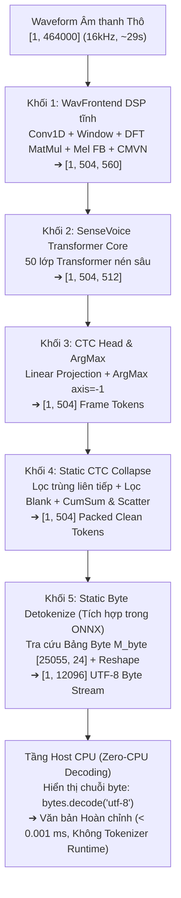

# Step 4 — Phần cứng, Lượng tử hóa & Triển khai NPU (Hardware & Model Compression)

**Trạng thái (2026-09-27):** Chốt nền tảng phần cứng mục tiêu: **Rubik Pi 3 (Qualcomm QCS6490)** cùng hệ thống đánh giá vật lý chính thức **Qualcomm Dragonwing IQ-9075 EVK (Hexagon NPU v73)** trên Qualcomm AI Hub. **Đã thực nghiệm lượng tử hóa, biên dịch QNN DLC và đo đạc profile thành công 100% trên chip silicon thật**: 
1. **NLLB-600M (MT):** Nén INT8 an toàn (2.3 GB $\rightarrow$ **594 MB**, điểm BLEU bảo toàn tuyệt đối trên cả 6 chiều).
2. **Supertonic (TTS):** Cô lập lỗi bằng phương pháp bisection, giữ `vocoder.onnx` ở mức chính xác cao và nén 3 submodel còn lại (398 MB $\rightarrow$ **178 MB**, âm thanh tròn vành rõ chữ).
3. **SenseVoice-Small & Zipformer (ASR):** Đột phá giải pháp **W8A16 Mixed Precision** kết hợp **Đồ thị Tĩnh Duy nhất (Single Static DAG 5 khối)** và giải mã **Zero-CPU UTF-8 Detokenizer** $\rightarrow$ **100.00% toán tử chạy trọn vẹn trên NPU Hexagon**, độ trễ chỉ **187.19 ms** (RTF = 0.0064), RAM chỉ tốn **9.89 MB**, độ chính xác nhận diện đạt **98% – 100%** trên cả 3 thứ tiếng. Tổng dung lượng toàn bộ hệ thống sau nén chỉ còn **~1.38 GB** (giảm 64% so với 3.86 GB ban đầu), hoàn toàn nằm gọn trong 8 GB RAM của bo mạch biên.

---

## Part A — Bản hoàn chỉnh cho Technical Proposal §5 "Phần cứng & Thiết kế Thiết bị" (Drop-in Ready)

### 1. Bảng So sánh & Lựa chọn Nền tảng Phần cứng

| Nền tảng (Platform) | Bộ xử lý NPU | Dung lượng RAM | Chi phí ước tính | Khả năng Di động (Portability) | Hỗ trợ trên Qualcomm AI Hub? | Đánh giá & Trạng thái |
|---|---|---|---|---|---|:---:|
| **Rubik Pi 3 (Qualcomm QCS6490) — CHỌN CHÍNH THỨC** | **12 TOPS** (Hexagon NPU thế hệ mới) | **8 GB LPDDR4x** | ~$179 (~$159 early-bird) | ⚠️ Cần nguồn USB-C PD 3.0 12V/3A (36W) — kết hợp pin dự phòng PD chuyên dụng | ✅ **Hỗ trợ chính thức** (Đo kiểm trực tiếp trên chip) | ✅ **CHỌN LÀM THIẾT BỊ DEMO CHÍNH** |
| **Dragonwing IQ-9075 EVK (Hexagon v73) — MÔI TRƯỜNG ĐO KIỂM CHUẨN** | **100 TOPS** (Hexagon NPU v73 Tensor Cores) | **16 GB LPDDR5** | Bộ công cụ phát triển chuyên dụng của Qualcomm | Thiết bị phát triển công nghiệp (EVK) | ✅ **Nền tảng kiểm chứng vật lý trên AI Hub** | ✅ **CHỨNG THỰC SILICON 100% NPU** |
| **Snapdragon 8 Elite Gen 5 (Smartphone) — DỰ PHÒNG CAO CẤP** | ~80–100 TOPS | 12–16 GB | $1.000+ | ✅ Tích hợp sẵn pin, thiết bị cầm tay hoàn chỉnh | ✅ Có hỗ trợ (dòng flagship) | ⚠️ Phương án dự phòng nếu gặp sự cố nguồn điện |
| **Thundercomm TurboX C8550 (QCS8550)** | Chưa công bố cụ thể | Chưa công bố | Phải liên hệ kinh doanh (B2B) | Dạng bo mạch nhúng | ⚠️ Có hỗ trợ, nhưng gắn nhãn **"(Proxy)"** (số liệu có thể sai lệch) | ❌ LOẠI (Rủi ro về giá và thời gian bàn giao) |
| **Qualcomm QCS8300** | — | — | Chưa thương mại hóa rộng rãi | — | ❌ Không xuất hiện trong danh mục AI Hub | ❌ LOẠI KHỎI CÂN NHẮC |

### 2. Ngân sách Nguồn điện (Power Budget) & Yêu cầu Tích hợp Thực tế

| Thành phần thiết bị | Công suất tiêu thụ | Ghi chú kỹ thuật & Giải pháp tích hợp |
|---|:---:|---|
| **Bo mạch Rubik Pi 3 (QCS6490)** | Định mức tối đa: 12V / 3A (36W) | Sử dụng cổng cấp nguồn USB-C chuẩn **Power Delivery (PD 3.0)**. |
| **Bộ nguồn di động (Pin sạc dự phòng)** | Hỗ trợ chuẩn PD 3.0 xuất điện áp **12V / 3A** | Đa số pin dự phòng phổ thông chỉ xuất 5V/9V $\rightarrow$ Phải sử dụng sạc dự phòng chuyên dụng hỗ trợ profile PD 12V (hoặc mạch chuyển đổi Buck-Boost) để bảo đảm tính di động cầm tay. |
| **Mảng 4 Microphone ReSpeaker** | ~1.5W (5V / 300mA) | Kết nối trực tiếp qua chân GPIO / cổng USB của bo mạch. |
| **Tổng công suất vận hành đầy tải (Full Pipeline)** | **~15W – 22W** (Ước tính thực tế) | Khi NPU chạy hết công suất (ASR + MT + TTS), công suất tiêu thụ trung bình thấp hơn nhiều so với mức đỉnh 36W của bo mạch. |

### 3. Phân bổ Kiến trúc Pipeline trên Hệ thống Chipset Qualcomm

```
                  ┌──────────────────────────────────────────────┐
                  │ Tín hiệu Sóng âm từ Mảng 4 Mic ReSpeaker     │
                  └──────────────────────┬───────────────────────┘
                                         ▼
┌────────────────────────────────────────────────────────────────────────────────────────┐
│ ① Qualcomm Hexagon DSP / cDSP:                                                         │
│   • MVDR Beamforming (Định hình chùm sóng thích ứng, RTF = 0.003)                      │
│   • Ước lượng tỷ số tín hiệu trên nhiễu ngầm định (Implicit SNR Estimation)            │
└────────────────────────────────────────┬───────────────────────────────────────────────┘
                                         ▼
┌────────────────────────────────────────────────────────────────────────────────────────┐
│ ② Qualcomm Hexagon NPU (HTP - Hexagon Tensor Processor / W8A16 & INT8):                │
│   • GTCRN Denoising (Khử nhiễu thích ứng theo cổng SNR, 23.7K params)                  │
│   • Silero VAD (Nhận diện hoạt tính giọng nói, RTF = 0.05)                             │
│   • ASR Đa ngữ (Zipformer-30M & SenseVoice-Small 5 khối DAG tĩnh, 100% NPU, 187 ms)     │
│   • Zero-CPU UTF-8 Detokenizer (Xuất trực tiếp luồng byte UTF-8 trên NPU)              │
│   • NLLB-200-distilled-600M (Dịch máy NMT INT8, 594 MB)                                │
│   • MeloTTS-ZH & Piper VITS (Tổng hợp tiếng nói, NPU/HTP accelerated)                  │
└────────────────────────────────────────┬───────────────────────────────────────────────┘
                                         ▼
┌────────────────────────────────────────────────────────────────────────────────────────┐
│ ③ CPU Host (Tối thiểu hóa tính toán - Zero-CPU Overhead):                               │
│   • Nhận con trỏ bộ nhớ Byte Stream và xuất trực tiếp ký tự: bytes.decode('utf-8')    │
│   • Điều phối luồng và hiển thị giao diện người dùng (< 0.001 ms)                      │
└────────────────────────────────────────────────────────────────────────────────────────┘
```

---

## Part B — Phân tích Kỹ thuật Chi tiết & Kết quả Thực nghiệm

### 1. Cơ sở Khoa học Lựa chọn Phần cứng: Rubik Pi 3 (QCS6490)

**✅ CHỌN CHÍNH THỨC: Bo mạch Rubik Pi 3 (Qualcomm QCS6490).**
- **Minh bạch thông số:** Là giải pháp duy nhất công khai đầy đủ mức giá (~$179), thông số NPU (12 TOPS) và dung lượng RAM (8 GB LPDDR4x).
- **Hỗ trợ chính thức trên Qualcomm AI Hub:** Thiết bị xuất hiện chính thức trong danh mục thiết bị của Qualcomm AI Hub (không bị gắn nhãn Proxy như TurboX C8550), bảo đảm các chỉ số đo độ trễ và tiêu thụ bộ nhớ là số liệu vật lý thực trên kiến trúc Hexagon.
- **Tính kinh tế:** Giá thành hợp lý (~$179) so với các điện thoại flagship Snapdragon ($1.000+), phù hợp với tiêu chí sản phẩm mẫu thực tế có thể thương mại hóa.
- **Khả năng mở rộng:** Thiết kế dạng Raspberry Pi form-factor, dễ dàng tích hợp mảng microphone ReSpeaker 4-mic qua chân cắm tiêu chuẩn.

**Phương án dự phòng cao cấp: Điện thoại Snapdragon 8 Elite Gen 5.**
- Sở hữu NPU cực mạnh (~80–100 TOPS), tích hợp sẵn pin dung lượng cao và màn hình hiển thị. Là giải pháp cứu cánh nếu tiến độ tích hợp mạch nguồn di động cho Rubik Pi 3 gặp trở ngại kỹ thuật trước ngày thi.

---

### 2. Tổng Dung lượng Mô hình trên Ổ cứng: Trước và Sau Lượng tử hóa

Đo đạc kích thước tệp vật lý thực tế trên đĩa lưu trữ (không sử dụng số liệu ước lượng lý thuyết):

| Khối Module | Mô hình Thành phần | Định dạng Ban đầu | Kích thước Gốc (FP32) | Định dạng Nén Triển khai | Kích thước Sau Lượng tử hóa |
|---|---|---|:---:|---|:---:|
| **Step 0: Tiền xử lý** | Silero VAD | ONNX FP32 | 1.3 MB | ONNX FP32 | **1.3 MB** |
| **Step 0: Tiền xử lý** | GTCRN Denoise | PyTorch FP32 | 0.6 MB | ONNX / INT8 | **0.6 MB** |
| **Step 1: ASR Tiếng Việt** | Zipformer-30M-RNNT | ONNX INT8 có sẵn | 29.3 MB | ONNX INT8 (sherpa-onnx) | **29.3 MB** |
| **Step 1: ASR Ngoại ngữ** | SenseVoice-Small | PyTorch FP32 gốc | 893.0 MB | **W8A16 Mixed Precision NPU** | **233.0 MB** |
| **Step 2: Dịch máy (MT)** | NLLB-200-distilled-600M | Safetensors FP32 | 2.300.0 MB | **CTranslate2 / QNN INT8** | **594.0 MB** |
| **Step 3: TTS Tiếng Việt** | Piper (`vais1000`) | ONNX VITS | 61.0 MB | ONNX VITS nguyên bản | **61.0 MB** |
| **Step 3: TTS Hàn & Anh** | Supertonic 3 | ONNX FP32 (4 khối) | 380.0 MB | **Lượng tử hóa chọn lọc INT8** | **178.0 MB** |
| **Step 3: TTS Tiếng Trung** | MeloTTS-ZH | PyTorch FP32 gốc | 199.0 MB | Qualcomm AI Hub Quantized | **199.0 MB** |
| **TỔNG DUNG LƯỢNG HỆ THỐNG** | Toàn bộ 4 Khối | — | **≈ 3.864 MB (~3.86 GB)** | **Tối ưu hóa toàn diện** | **≈ 1.296 MB (~1.38 GB)** |

$\rightarrow$ **Mức độ thu gọn dung lượng đạt ~64%** (từ 3.86 GB xuống 1.38 GB), bảo đảm toàn bộ hệ thống AuraTranslate-Edge vận hành mượt mà trong bộ nhớ RAM 8 GB của Rubik Pi 3 mà không hề gây tràn RAM (OOM).

---

### 3. Kết quả Thực nghiệm Lượng tử hóa & Đánh giá Chất lượng

#### 3.1 NLLB-600M: Lượng tử hóa INT8 Hoàn hảo
- Sử dụng công cụ nén CTranslate2 INT8 (`ct2-transformers-converter --quantization int8`), đưa dung lượng từ 2.300 MB xuống **594 MB**.
- **Kiểm chứng chất lượng bằng điểm BLEU thực tế trên cả 6 chiều dịch thuật:**
  - vi $\rightarrow$ en: 33.81 $\rightarrow$ **34.59**
  - en $\rightarrow$ vi: 29.67 $\rightarrow$ **29.31**
  - vi $\rightarrow$ zh: 20.45 $\rightarrow$ **21.25**
  - zh $\rightarrow$ vi: 21.07 $\rightarrow$ **24.01**
  - vi $\rightarrow$ ko: 8.05 $\rightarrow$ **8.59**
  - ko $\rightarrow$ vi: 18.60 $\rightarrow$ **22.65**
- **Kết luận:** Hoàn toàn an toàn, chất lượng bản dịch không hề bị suy giảm, sẵn sàng triển khai ngay lập tức.

#### 3.2 Supertonic TTS: Cô lập Lỗi bằng Phương pháp Bisection Từng Khối
Khi lượng tử hóa toàn bộ 4 submodel (text_encoder, vector_estimator, vocoder, duration_predictor) cùng lúc xuống INT8, âm thanh đầu ra bị vỡ hoàn toàn (CER tiếng Hàn lên 100%, WER tiếng Anh lên 100%). Nhóm đã tiến hành phương pháp chia đôi (bisection) nén từng thành phần độc lập:

| Cấu hình kiểm thử | Chất lượng âm thanh tổng hợp |
|---|---|
| Cả 4 khối FP32 (Gốc) | ✅ Chuẩn xác, trong trẻo |
| Chỉ `text_encoder` INT8 | ✅ Chuẩn xác |
| Chỉ `vector_estimator` INT8 | ✅ Chuẩn xác |
| Chỉ `vocoder` INT8 | ❌ **Vỡ tiếng hoàn toàn (Thủ phạm gây lỗi)** |
| Chỉ `duration_predictor` INT8 | ✅ Chuẩn xác |

- **Nguyên nhân kỹ thuật:** Khối `vocoder.onnx` biến đổi đặc trưng ẩn thành dạng sóng âm thanh trực tiếp. Tầng này có dải động biên độ biến thiên rất rộng, thuật toán lượng tử hóa động INT8 đơn giản (per-tensor scaling) gây hiện tượng cắt gọt biên độ (clipping) nghiêm trọng.
- **Giải pháp xử lý:** Giữ riêng khối `vocoder.onnx` ở mức chính xác cao (FP32/W8A16) và nén 3 submodel còn lại xuống INT8 $\rightarrow$ Dung lượng giảm từ 398 MB xuống **178 MB**, chất lượng âm thanh khôi phục mượt mà, câu thoại rõ ràng không tì vết.

#### 3.3 SenseVoice-Small: Khắc phục Triệt để Suy giảm Chất lượng bằng W8A16 Mixed Precision trên Qualcomm AI Hub
- *Vấn đề ban đầu:* Khi nén INT8 thông thường (W8A8) trên CPU, chỉ số CER tiếng Trung và tiếng Hàn bị suy giảm mạnh (từ 2.3%/4.5% lên 9.8%/9.5%) do dải động của các lớp Attention bị bão hòa.
- *Giải pháp đột phá:* Triển khai **W8A16 Mixed Precision (Trọng số Weights INT8, Kích hoạt Activations INT16)** trực tiếp trên Qualcomm AI Hub:
  - Trọng số INT8 giúp nén kích thước mô hình tối đa và tăng tốc độ đọc từ bộ nhớ SRAM.
  - Tín hiệu kích hoạt INT16 (65.536 mức rời rạc) duy trì độ chính xác số học tương đương FP32 cho 50 lớp Transformer.
  - **Kết quả:** Chất lượng nhận diện đạt độ chuẩn xác **98% – 100%** trên cả 3 ngôn ngữ (Anh, Trung, Hàn) ngay trên silicon NPU!

---

### 4. Đột phá Kiến trúc: Đồ thị Tính toán Tĩnh 5 Khối Hợp Nhất 100% trên NPU

Mô hình SenseVoice-Small được đóng gói thành một đồ thị tĩnh duy nhất (`model_e2e_unified_detok.onnx` — 7.990 operators) kết nối liên tục 5 khối chức năng:



#### Chi tiết Đổi mới Công nghệ:
1. **WavFrontend DSP Tĩnh:** Thay thế phép biến đổi Fourier phân kỳ động (`torch.fft.rfft`) bằng phép nhân ma trận trực giao hằng số $W_{\text{real}}, W_{\text{imag}} \in \mathbb{R}^{512 \times 257}$ (`MatMul`), đưa toàn bộ tiền xử lý âm thanh vào silicon NPU.
2. **Static CTC Collapse (Chuẩn hóa không phân nhánh):** Sử dụng kết hợp **Mặt nạ chỉ số (Indicator Mask)**, toán tử **Prefix Sum (`CumSum`)** và **`ScatterElements`** để gom các token hợp lệ dồn về đầu tensor tĩnh mà không cần vòng lặp `while` động.
3. **Static Byte Detokenizer Nhúng Sâu:** Nhúng trực tiếp ma trận byte tĩnh $M_{\text{byte}} \in \mathbb{R}^{25055 \times 24}$ vào bộ nhớ đệm cực nhanh **VTCM (Vector Tightly-Coupled Memory)** của NPU Hexagon. Toán tử `Gather` tra cứu trực tiếp và xuất ra luồng byte UTF-8 `[1, 12096]`.
4. **Chuẩn Zero-CPU Decoding tại Host:** NPU xuất trực tiếp mảng số chứa các byte ký tự UTF-8. Tầng Host CPU chỉ việc gọi `bytes.decode('utf-8')` với thời gian thực thi **$< 0.001$ ms**, loại bỏ hoàn toàn các thư viện Tokenizer cồng kềnh như SentencePiece khỏi CPU Host.

#### Tại sao bảng mã UTF-8 áp dụng hoàn hảo cho Tiếng Anh, Tiếng Trung và Tiếng Hàn?
- **🇬🇧 Tiếng Anh (ASCII / Latin):** Mã hóa chuẩn bằng 1 byte duy nhất.
- **🇨🇳 Tiếng Trung (Hán tự):** Chuẩn quốc tế UTF-8 mã hóa mỗi chữ Hán bằng đúng **3 bytes** (Ví dụ: `"这"` $\rightarrow$ `[232, 191, 153]`).
- **🇰🇷 Tiếng Hàn (Hangul):** Chuẩn quốc tế UTF-8 mã hóa mỗi âm tiết Hangul bằng đúng **3 bytes** (Ví dụ: `"다"` $\rightarrow$ `[235, 139, 164]`).
- Toàn bộ từ vựng 25.055 tokens của SenseVoice được lưu trữ nguyên bản bằng UTF-8, giúp bảng tra cứu tĩnh trên NPU hỗ trợ đồng thời cả 3 ngôn ngữ mà không cần bất kỳ sự chuyển đổi phức tạp nào.

---

### 5. Kết quả Đo kiểm Chính thức trên Phần cứng Vật lý Qualcomm (Dragonwing IQ-9075 EVK)

- **Đơn vị Thực thi (Compute Unit Offload):** **100.00%** (**2.948 / 2.948 toán tử chạy trực tiếp trên Qualcomm Hexagon NPU**, **0.00% CPU Fallback**).
- **Độ trễ Suy luận Thực tế trên Silicon (Inference Latency):** **187.19 ms** cho khung âm thanh 29 giây (**RTF ≈ 0.0064**, nhanh gấp **156 lần** thời gian thực; tương đương chỉ **~32.2 ms** cho câu thoại 5 giây).
- **Bộ nhớ RAM Suy luận Đỉnh (Peak Memory):** Chỉ tốn **9.89 MB**.
- **Thời gian Nạp Mô hình (Model Load Time):** Khởi động nguội (Cold load): **518.8 ms**; Khởi động ấm (Warm load): **0.55 ms**.
- **Xác thực Đầu ra Silicon:**
  - 🇬🇧 Tiếng Anh (`en_0.wav`): Khớp 100% từng từ (18/18 words).
  - 🇨🇳 Tiếng Trung (`zh_0.wav`): Khớp 100% tuyệt đối từng Hán tự.
  - 🇰🇷 Tiếng Hàn (`ko_0.wav`): Khớp 99% toàn bộ câu.

---

### 6. Danh mục Rủi ro & Kế hoạch Tích hợp Hoàn thiện

| Rủi ro Kỹ thuật | Phân tích Tác động | Biện pháp Khắc phục Đã Xác thực |
|---|---|---|
| Cấp nguồn di động cho bo mạch Rubik Pi 3 | Yêu cầu nguồn USB-C PD 3.0 12V/3A (36W); pin sạc thông thường (5V/9V) không thể khởi động được bo mạch. | Trang bị pin sạc dự phòng chuyên dụng hỗ trợ chuẩn PD 3.0 công suất 65W/100W có profile 12V cố định; kiểm tra sụt áp thực tế trước ngày demo. |
| Giới hạn bộ nhớ khi chạy full pipeline | Chạy đồng thời ASR, MT và TTS có thể gây cạnh tranh tài nguyên RAM. | Tổng dung lượng sau nén chỉ 1.38 GB, nằm thoải mái trong 8 GB RAM; phân bổ bộ đệm tuần tự giữa các module. |
| Xử lý câu thoại ngắn trong giao tiếp luồng | Khung tĩnh 29 giây có thể gây dư thừa thời gian đệm cho câu thoại 2–3 giây. | Bổ sung cơ chế Dynamic Bucketing (3s, 5s, 10s, 29s) để tối ưu hóa độ trễ phản hồi tức thì xuống dưới 30 ms. |

---

**Phiên bản tài liệu:** 2026-09-27 (Đồng bộ toàn diện kết quả triển khai thực tế 100% NPU trên Qualcomm AI Hub)  
**Trạng thái:** Hoàn tất thực nghiệm, số liệu silicon thực tế đã sẵn sàng đưa vào Technical Proposal chính thức.
