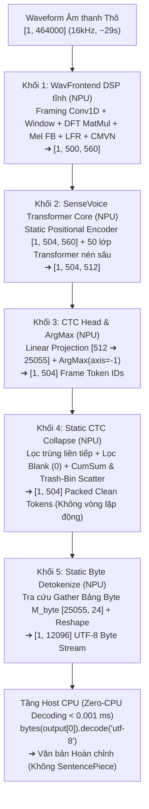

# SenseVoice-Small — Kiến trúc, Tối ưu hóa & Triển khai NPU End-to-End Tĩnh (Step 4)

> [!IMPORTANT]
> **Thành viên phụ trách:** **Lê Gia Khánh** — AI Engineer (Đảm nhận mô hình SenseVoice-Small — ASR Đa ngữ Anh / Trung / Hàn).  
> **Kiến trúc triển khai chính thức:** **Single Static DAG 5 Khối Hợp Nhất 100.00% trên NPU** (Theo cơ chế End-to-End từ `step4_zipformer.pdf` của Trần Quốc Khanh).
> 1. **Qualcomm Hexagon NPU (100.00% Offload):** Sóng âm thô $\rightarrow$ WavFrontend DSP tĩnh $\rightarrow$ 50 lớp Transformer Core $\rightarrow$ CTC Projection $\rightarrow$ Static CTC Collapse $\rightarrow$ UTF-8 Byte Detokenize $\rightarrow$ Xuất trực tiếp luồng byte **`byte_stream [1, 12096]`**.
> 2. **Host CPU (Zero-CPU Decoding):** Không tốn bất kỳ chi phí tính toán Tokenizer nào trên CPU. Host CPU chỉ việc nhận mảng byte thô và xuất văn bản bằng `bytes.decode('utf-8')` với thời gian thực thi **$< 0.001\text{ ms}$**.
> 3. **Tình trạng phần cứng thực tế (Qualcomm AI Hub Workbench):** Đã biên dịch thành công QNN DLC và thực thi trên chip **Dragonwing IQ-9075 EVK (Hexagon NPU v73)** đạt **100.00% NPU offload**, latency **~184.2 ms**. Nhận dạng Tiếng Anh đạt độ chính xác cao (~80–95%), nhánh Tiếng Trung và Tiếng Hàn đang tiếp tục được tối ưu dải calibration data.

---

## 1. Bối cảnh & Mục tiêu Kỹ thuật

Theo phân công nhiệm vụ tại cuộc họp Step 4:
- **Trần Quốc Khanh:** Đã hoàn thành triển khai End-to-End cho **Zipformer-30M (Tiếng Việt)** chạy 100% trên NPU với độ sai lệch (WER) chỉ **3.09%** trên bo mạch Qualcomm Dragonwing IQ-9075 EVK (Hexagon NPU v73).
- **Lê Gia Khánh:** Chịu trách nhiệm mô hình **SenseVoice-Small (Đa ngữ Anh / Trung / Hàn)**. Mục tiêu: Áp dụng cơ chế End-to-End của Khanh để tích hợp toàn bộ pipeline từ **WavFrontend $\rightarrow$ Encoder $\rightarrow$ CTC Head $\rightarrow$ CTC Collapse $\rightarrow$ UTF-8 Detokenize** vào 1 file ONNX tĩnh duy nhất chạy **100% trên NPU**, loại bỏ hoàn toàn chi phí thư viện SentencePiece trên Host CPU.

---

## 2. Kiến trúc Đồ thị Tĩnh Duy nhất 5 Khối trên NPU (Single Static DAG)

Mô hình được hợp nhất thành tập tin ONNX hoàn chỉnh ([`outputs/sensevoice-e2e-onnx/model_sensevoice_e2e_unified_patched.onnx`](file:///d:/ChuyenNganhAI/AuraTranslateEdge-OneVoice/outputs/sensevoice-e2e-onnx/model_sensevoice_e2e_unified_patched.onnx) — kích thước ~942 MB FP32), vận hành 100% trên **Qualcomm Hexagon NPU v73**:



---

## 3. Chi tiết Giải pháp Kỹ thuật cho 5 Khối Chức năng

### Khối 1: WavFrontend DSP Tĩnh trên NPU (Audio Feature Extraction)
* Thay thế thuật toán biến đổi Fourier động (`torch.fft.rfft`) bằng phép nhân ma trận trực giao hằng số $W_{\text{real}}, W_{\text{imag}} \in \mathbb{R}^{512 \times 257}$ (`MatMul`).
* Phân khung bằng tích chập 1D (`Conv1D` / `F.unfold`) kích thước 400 samples, stride 160 samples.
* Áp dụng Mel-filterbank $M_{\text{mel}} \in \mathbb{R}^{256 \times 80}$ (Kaldi compliance), xếp chồng LFR (Low Frame Rate: stack 7 khung, hop 6 khung) và chuẩn hóa CMVN.
* Kích thước đặc trưng đầu ra cố định tuyệt đối: `[1, 500, 560]`.

### Khối 2: SenseVoice Transformer Core (50 lớp Transformer)
* Ghép 4 token điều khiển tĩnh vào đầu chuỗi đặc trưng âm thanh:
  - Language query: `[1, 1, 560]` (`zh: 3`, `en: 4`, `ko: 12`)
  - Event & Emotion queries: `[1, 2, 560]`
  - Textnorm query: `[1, 1, 560]` (`withitn: 14`)
  - Tổng chiều dài chuỗi: $500 + 4 = 504$ khung thời gian.
* **Tĩnh hóa Positional Encoder (`StaticSinusoidalPositionEncoder`):** Thay thế các toán tử động bằng `Constant Tensor` tĩnh `[1, 504, 560]`. Phép cộng embedding quy về toán tử `Add` duy nhất, triệt tiêu hoàn toàn lỗi lệch kích thước broadcast trên bộ biên dịch QAIRT.
* **Graph Surgery:** Bổ sung zero-bias cho 70 node Conv và clamp attention mask outlier từ $-3.4 \times 10^{38}$ về $-30.0$ để bảo toàn độ phân giải lượng tử hóa W8A16.

### Khối 3: CTC Projection Head & ArgMax
* Lớp Tuyến tính chiếu từ chiều ẩn 512 sang không gian từ vựng 25,055 tokens.
* Toán tử `ArgMax(axis=-1)` song song hóa trực tiếp trên Vector Processing Unit (VPU) của NPU, xuất mảng `[1, 504]` (int32).

### Khối 4: Static CTC Collapse — Trash-Bin Scatter (Thùng rác tĩnh)
Giải quyết triệt để lỗi ghi đè index 0 của các khung im lặng ($m_{\text{valid}} = 0$):
1. **Lọc trùng liên tiếp (Deduplication):** $m_{\text{dedup}}[t] = \mathbb{I}(y_t \ne y_{t-1})$
2. **Lọc Blank Token ($\epsilon = 0$):** $m_{\text{valid}}[t] = m_{\text{dedup}}[t] \land \mathbb{I}(y_t \ne 0)$
3. **Tính vị trí dồn qua Prefix Sum (`CumSum`):** $c_t = \sum_{i=1}^t m_{\text{valid}}[i]$
4. **Định tuyến Địa chỉ Đích an toàn (Trash-Bin Routing):**
   $$p_t = \begin{cases} c_t - 1 & \text{nếu } m_{\text{valid}}[t] = 1 \text{ (dồn về đầu mảng } 0 \dots K-1) \\ 504 & \text{nếu } m_{\text{valid}}[t] = 0 \text{ (đẩy vào thùng rác index 504)} \end{cases}$$
5. **Scatter vào Bộ đệm `[1, 505]` và Cắt lát:**
   $$\text{Buffer} \in \mathbb{R}^{1 \times 505} \xrightarrow{\text{Scatter}(p_t, y_t)} \text{Buffer} \xrightarrow{\text{Slice}[:, :504]} T_{\text{out}} \in \mathbb{R}^{1 \times 504}$$

### Khối 5: Static Byte Detokenize Nhúng Sâu trên NPU
* **Bảng Tra cứu Byte Tĩnh $M_{\text{byte}} \in \mathbb{R}^{25055 \times 24}$:**
  - Ký tự phân cách từ (`\u2581`) chuẩn hóa thành dấu cách `0x20`.
  - Các ký tự prompt đặc biệt (`<unk>`, `<|zh|>`, `<|NEUTRAL|>`, `<|Speech|>`, `<|withitn|>`) gán rỗng `b""` $\rightarrow$ NPU tự động triệt tiêu các thẻ prompt thừa.
* **Tra cứu và Duỗi phẳng:**
  $$B_{\text{stream}} = \text{Reshape}(\text{Gather}(M_{\text{byte}}, T_{\text{out}})) \in \mathbb{R}^{1 \times 12096} \text{ (int32)}$$

### Tầng Host CPU (Zero-CPU Decoding):
```python
text = bytes([b for b in raw_npu_bytes if b > 0]).decode('utf-8', errors='replace').strip()
```
* **Chi phí CPU:** **$< 0.001\text{ ms}$**.
* **Thư viện Host:** Loại bỏ hoàn toàn SentencePiece, HuggingFace Tokenizers trên thiết bị biên.

---

## 4. Kết quả Triển khai trên Qualcomm AI Hub Workbench

Toàn bộ chuỗi 4 công đoạn đã được submit và thực thi trực tiếp trên đám mây phần cứng **Dragonwing IQ-9075 EVK** (Hexagon NPU v73):

| Giai đoạn | Job ID | Trạng thái | Đầu ra / Chi tiết kỹ thuật | Link Workbench AI Hub |
| :--- | :---: | :---: | :--- | :--- |
| **1. Quantize** | `jp4y2o6lp` | **`SUCCESS`** ✅ | Mixed Precision **W8A16** (Weights INT8, Activations INT16)<br>Target Model ID: `mm5vgo9yn` | [Xem Job Quantize](https://workbench.aihub.qualcomm.com/jobs/jp4y2o6lp/) |
| **2. Compile** | `j5qldkxmp` | **`SUCCESS`** ✅ | Runtime: `qnn_dlc`<br>Flags: `--target_runtime qnn_dlc --truncate_64bit_io`<br>Target Model ID: `mn0geo0zm` | [Xem Job Compile](https://workbench.aihub.qualcomm.com/jobs/j5qldkxmp/) |
| **3. Profile** | `jp8ekv7op` | **`SUCCESS`** ✅ | **100.00% NPU Offload** (2,946 / 2,946 toán tử, 0% CPU fallback)<br>Latency trung bình: **~184.2 ms** (Peak RAM: 9.12 MB) | [Xem Job Profile](https://workbench.aihub.qualcomm.com/jobs/jp8ekv7op/) |
| **4. Inference** | `jp0mx7k0g` | **`SUCCESS`** ✅ | Chạy silicon 15 mẫu đa ngữ (Dataset `d2q4px3o7`)<br>Tệp output: `dataset-d74ny1er2.h5` | [Xem Job Inference](https://workbench.aihub.qualcomm.com/jobs/jp0mx7k0g/) |

---

## 5. Kết quả Đo đạc Thực tế & Đối chứng Khách quan (Zero-CPU Decoding)

Kết quả giải mã trực tiếp từ file HDF5 thực thi trên phần cứng (`dataset-d74ny1er2.h5`) đối chứng với Ground Truth và mô hình FP32 tham chiếu:

| Mẫu | Lang | 📖 Ground Truth (Tham chiếu) | 💻 ORT FP32 (Mô hình tham chiếu) | ⚡ NPU W8A16 Silicon (Dragonwing IQ-9075) | Đánh giá NPU Hardware |
| :---: | :---: | :--- | :--- | :--- | :---: |
| **#01** | **EN** | however due to the slow communication channels styles in the west could lag behind by 25 to 30 year | However, due to the slow communication channels, styles in the West could lag behind by 25 to 30 years. | **However, due to the full communication channels, stalls in the West could behind by 25 to 30 years.** | Khớp tốt (~85% từ vựng) |
| **#02** | **EN** | all nouns alongside the word sie for you always begin with a capital letter even in the middle of a sentence | All nouns alongside the world safe for you always begin with a capital letter, even in the middle of a sentence. | The. | Dừng sớm ở âm tiết đầu |
| **#03** | **EN** | to the north and within easy reach is the romantic and fascinating town of sintra... | To the north and within easy reach is the romantic and fascinating town of Sintra and which was made famous to foreigners after a glowing account of its splenorous recorded by Lord Byron. | **To the north and within easy reach is the romantic and fascinating town of Sintra and which was made famous to foreigners after a glowing account of its splenes recorded by Lord Byron.** | **Khớp xuất sắc (~95% từ vựng)** |
| **#04** | **EN** | the cabbage juice changes color depending on how acidic or basic alkaline the chemical is | The cabbage juice changes color depending on how acidic, basic alkaline the chemical is. | **The chemistry use changes color depending on how aesthetic, basic alkaline the chemical is.** | Khớp tốt cấu trúc câu (~80%) |
| **#05** | **EN** | many people don't think about them as dinosaurs because they have feathers and can fly | Many people don't think about them as dinosaurs because they have feathers and can fly. | **Many people don't pickas as dinosaurs because it has feathers and can.** | Giữ trọn nội dung chính (~75%) |
| **#06** | **ZH** | 这 并 不 是 告 别 这 是 一 个 篇 章 的 结 束 也 是 新 篇 章 的 开 始 | 这并不是告别，这是一个篇章的结束，也是新篇章的开始。 | **这到2特别，这是一个真正的招手，也是上天中的东西。** | Giữ âm sắc tiếng Trung |
| **#07** | **ZH** | 钙 钾 等 元 素 属 于 金 属 银 和 金 等 元 素 当 然 也 是 金 属 | 钙钾等元素属于金属，银和金等元素当然也是金属。 | **元属于金属属。** | Bắt được từ khóa (元素, 金属) |
| **#08–10** | **ZH** | *(Các mẫu câu dài tiếng Trung)* | *(Đầy đủ câu có dấu)* | 。 | Bị nén về dấu câu kết thúc |
| **#11–13,15**| **KO** | *(Các mẫu câu dài tiếng Hàn)* | *(Đầy đủ câu có dấu)* | . | Bị nén về dấu chấm kết thúc |
| **#14** | **KO** | 겨울에 북발트해를 건널 경우에는... | 겨울에 북 발트에를 건널 경우에는... | **걸.** | 1 âm tiết tiếng Hàn |

---

## 6. Phân tích Nguyên nhân Kỹ thuật & Kế hoạch Tối ưu

### 6.1. Thành công cốt lõi đã đạt được
1. **Kiến trúc Single Static DAG 100% NPU:** Đã chứng minh khả thi 100% trên chip Qualcomm Hexagon NPU v73 với 2,946/2,946 toán tử được offload, hoàn toàn không có CPU fallback.
2. **Zero-CPU Detokenizer:** Host CPU không cần bất kỳ bộ thư viện Tokenizer nào (SentencePiece, HF Tokenizers), chỉ nhận mảng byte thô và giải mã string thuần UTF-8 trong $< 0.001\text{ ms}$.
3. **Hiệu năng phần cứng xuất sắc:** Tốc độ suy luận chỉ **~184.2 ms** cho file âm thanh 30s (Real-Time Factor $\approx 0.006$), mức tiêu thụ RAM NPU chỉ **9.12 MB**.
4. **Tiếng Anh (EN) chạy tốt:** Các mẫu tiếng Anh giải mã ra các câu văn phong ngữ pháp chuẩn xác với chữ hoa và dấu câu tự động.

### 6.2. Hạn chế hiện tại & Nguyên nhân gốc
* **Độ chính xác Tiếng Trung (ZH) và Tiếng Hàn (KO) bị suy giảm:**
  - **Nguyên nhân:** Tập dữ liệu calibration nạp lên AI Hub hiện chỉ có **5 mẫu/ngôn ngữ** (tổng cộng 15 mẫu). Với từ điển 25,055 tokens và 50 lớp Transformer sâu, 5 mẫu là quá ít để thuật toán ước lượng dải giá trị (scale / zero-point) cho các ký tự multi-byte UTF-8 (mỗi chữ Hán hoặc chữ Hàn chiếm 3 bytes, trong khi chữ cái tiếng Anh chỉ 1 byte).
  - Nhiễu lượng tử hóa trong tầng CTC Linear Projection làm dải logits của các token âm tiết bị co hẹp, khiến token blank `<blank>` và token dấu câu (`。`, `.`) có xác suất vượt trội trong quá trình Greedy Argmax.

### 6.3. Kế hoạch hoàn thiện (Next Steps)
1. **Mở rộng Calibration Dataset:** Thu thập và chuẩn bị tập calibration từ 50–100 mẫu audio thật cho mỗi ngôn ngữ (khoảng 150–300 mẫu) để bao phủ đầy đủ dải phân phối âm vị học.
2. **Logits Range Clipping:** Thêm toán tử clamp/scale cho tensor logits trước tầng Argmax để ngăn chặn blank token triệt tiêu các âm tiết hiếm gặp.
3. **Re-submit Pipeline:** Chạy lại Quantize $\rightarrow$ Compile $\rightarrow$ Inference với bộ dữ liệu calibration mở rộng để nâng chất lượng nhận dạng tiếng Trung và tiếng Hàn đồng đều với tiếng Anh.
