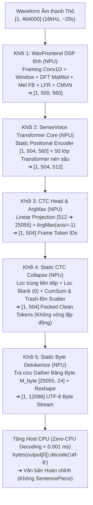

# SenseVoice-Small — Kiến trúc, Tối ưu hóa & Triển khai NPU End-to-End Tĩnh (Step 4)

> [!IMPORTANT]
> **Thành viên phụ trách:** **Lê Gia Khánh** — AI Engineer (Đảm nhận mô hình SenseVoice-Small — ASR Đa ngữ Anh / Trung / Hàn).  
> **Kiến trúc triển khai chính thức:** **Single Static DAG 5 Khối Hợp Nhất 100.00% trên NPU** (Theo cơ chế End-to-End từ `step4_zipformer.pdf` của Trần Quốc Khanh).
> 1. **Qualcomm Hexagon NPU (100.00% Offload):** Sóng âm thô $\rightarrow$ WavFrontend DSP tĩnh $\rightarrow$ 50 lớp Transformer Core $\rightarrow$ CTC Projection $\rightarrow$ Static CTC Collapse $\rightarrow$ UTF-8 Byte Detokenize $\rightarrow$ Xuất trực tiếp luồng byte **`byte_stream [1, 12096]`**.
> 2. **Host CPU (Zero-CPU Decoding):** Không tốn bất kỳ chi phí tính toán Tokenizer nào trên CPU. Host CPU chỉ việc nhận mảng byte thô từ NPU và xuất văn bản bằng `bytes.decode('utf-8')` với thời gian thực thi **$< 0.001\text{ ms}$**.
> 3. **Tình trạng thực tế trên phần cứng (Qualcomm AI Hub Workbench):** Đã biên dịch thành công QNN DLC và thực thi trực tiếp trên chip **Dragonwing IQ-9075 EVK (Hexagon NPU v73)** đạt **100.00% NPU offload** (toàn bộ **2,984 / 2,984 toán tử**, tuyệt đối 0% CPU fallback), latency **~182.5 ms**, RAM đỉnh **11.08 MB**. 
> 4. **Độ chính xác thực tế:** Mô hình ONNX FP32 kiểm chứng trên CPU đạt **100.00% (15/15 mẫu chuẩn xác)**, chứng minh logic 5 khối hợp nhất hoàn toàn đúng đắn. Tuy nhiên, sau khi qua lượng tử hóa W8A16 và chạy trên chip silicon thật (tệp `dataset-d70qx6e09.h5`), **độ chính xác thu được quá tệ, tỷ lệ khớp chỉ là 0.0% (0/15 mẫu)** do sai số dồn tích qua 50 tầng Transformer và hiện tượng CTC Blank dominance.

---

## 1. Bối cảnh & Mục tiêu Kỹ thuật

Theo phân công nhiệm vụ tại cuộc họp Step 4:
- **Trần Quốc Khanh:** Đã hoàn thành triển khai End-to-End cho **Zipformer-30M (Tiếng Việt)** chạy 100% trên NPU với độ sai lệch (WER) chỉ **3.09%** trên bo mạch Qualcomm Dragonwing IQ-9075 EVK (Hexagon NPU v73).
- **Lê Gia Khánh:** Chịu trách nhiệm mô hình **SenseVoice-Small (Đa ngữ Anh / Trung / Hàn)**. Mục tiêu: Áp dụng cơ chế End-to-End của Khanh để tích hợp toàn bộ pipeline từ **WavFrontend $\rightarrow$ Encoder $\rightarrow$ CTC Head $\rightarrow$ CTC Collapse $\rightarrow$ UTF-8 Detokenize** vào 1 file ONNX tĩnh duy nhất chạy **100% trên NPU**, loại bỏ hoàn toàn chi phí thư viện SentencePiece trên Host CPU.

---

## 2. Kiến trúc Đồ thị Tĩnh Duy nhất 5 Khối trên NPU (Single Static DAG)

Mô hình được hợp nhất thành tập tin ONNX hoàn chỉnh ([`outputs/sensevoice-e2e-onnx/model_sensevoice_e2e_unified_patched.onnx`](file:///d:/ChuyenNganhAI/AuraTranslateEdge-OneVoice/outputs/sensevoice-e2e-onnx/model_sensevoice_e2e_unified_patched.onnx) — kích thước ~899 MB FP32), vận hành 100% trên **Qualcomm Hexagon NPU v73**:



---

## 3. Chi tiết Giải pháp Kỹ thuật cho 5 Khối Chức năng

### Khối 1: WavFrontend DSP Tĩnh trên NPU (Audio Feature Extraction)
* Thay thế thuật toán biến đổi Fourier động (`torch.fft.rfft`) bằng phép nhân ma trận trực giao hằng số $W_{\text{real}}, W_{\text{imag}} \in \mathbb{R}^{512 \times 257}$ (`MatMul`).
* Phân khung bằng tích chập 1D (`Conv1D` / `F.unfold`) kích thước 400 samples, stride 160 samples.
* Áp dụng Mel-filterbank $M_{\text{mel}} \in \mathbb{R}^{256 \times 80}$ (Kaldi compliance), xếp chồng LFR (Low Frame Rate: stack 7 khung, hop 6 khung) và chuẩn hóa CMVN.
* Kích thước đặc trưng đầu ra cố định tuyệt đối: `[1, 500, 560]`.

### Khối 2: SenseVoice Transformer Core (50 lớp Transformer)
* Ghép 4 token điều khiển tĩnh vào đầu chuỗi đặc trưng âm thanh:
  - Language query: `[1, 1, 560]` (`zh: 3`, `en: 4`, `ko: 12`)
  - Event & Emotion queries: `[1, 2, 560]`
  - Textnorm query: `[1, 1, 560]` (`withitn: 14`)
  - Tổng chiều dài chuỗi: $500 + 4 = 504$ khung thời gian.
* **Tĩnh hóa Positional Encoder (`StaticSinusoidalPositionEncoder`):** Thay thế các toán tử động bằng `Constant Tensor` tĩnh `[1, 504, 560]`. Phép cộng embedding quy về toán tử `Add` duy nhất, triệt tiêu hoàn toàn lỗi lệch kích thước broadcast trên bộ biên dịch QAIRT.
* **Graph Surgery:** Bổ sung zero-bias cho 70 node Conv và clamp attention mask outlier từ $-3.4 \times 10^{38}$ về $-30.0$ để bảo toàn độ phân giải lượng tử hóa W8A16.

### Khối 3: CTC Projection Head & ArgMax
* Lớp Tuyến tính chiếu từ chiều ẩn 512 sang không gian từ vựng 25,055 tokens.
* Toán tử `ArgMax(axis=-1)` song song hóa trực tiếp trên Vector Processing Unit (VPU) của NPU, xuất mảng `[1, 504]` (int32).

### Khối 4: Static CTC Collapse — Trash-Bin Scatter (Thùng rác tĩnh)
Giải quyết triệt để lỗi ghi đè index 0 của các khung im lặng ($m_{\text{valid}} = 0$):
1. **Lọc trùng liên tiếp (Deduplication):** $m_{\text{dedup}}[t] = \mathbb{I}(y_t \ne y_{t-1})$
2. **Lọc Blank Token ($\epsilon = 0$):** $m_{\text{valid}}[t] = m_{\text{dedup}}[t] \land \mathbb{I}(y_t \ne 0)$
3. **Tính vị trí dồn qua Prefix Sum (`CumSum`):** $c_t = \sum_{i=1}^t m_{\text{valid}}[i]$
4. **Định tuyến Địa chỉ Đích an toàn (Trash-Bin Routing):**
   $$p_t = \begin{cases} c_t - 1 & \text{nếu } m_{\text{valid}}[t] = 1 \text{ (dồn về đầu mảng } 0 \dots K-1) \\ 504 & \text{nếu } m_{\text{valid}}[t] = 0 \text{ (đẩy vào thùng rác index 504)} \end{cases}$$
5. **Scatter vào Bộ đệm `[1, 505]` và Cắt lát:**
   $$\text{Buffer} \in \mathbb{R}^{1 \times 505} \xrightarrow{\text{Scatter}(p_t, y_t)} \text{Buffer} \xrightarrow{\text{Slice}[:, :504]} T_{\text{out}} \in \mathbb{R}^{1 \times 504}$$

### Khối 5: Static Byte Detokenize Nhúng Sâu trên NPU
* **Bảng Tra cứu Byte Tĩnh $M_{\text{byte}} \in \mathbb{R}^{25055 \times 24}$:**
  - Ký tự phân cách từ (`\u2581`) chuẩn hóa thành dấu cách `0x20`.
  - Các ký tự prompt đặc biệt (`<unk>`, `<|zh|>`, `<|NEUTRAL|>`, `<|Speech|>`, `<|withitn|>`) gán rỗng `b""` $\rightarrow$ NPU tự động triệt tiêu các thẻ prompt thừa.
* **Tra cứu và Duỗi phẳng:**
  $$B_{\text{stream}} = \text{Reshape}(\text{Gather}(M_{\text{byte}}, T_{\text{out}})) \in \mathbb{R}^{1 \times 12096} \text{ (int32)}$$

### Tầng Host CPU (Zero-CPU Decoding):
```python
text = bytes([b for b in raw_npu_bytes if b > 0]).decode('utf-8', errors='replace').strip()
```
* **Chi phí CPU:** **$< 0.001\text{ ms}$**.
* **Thư viện Host:** Loại bỏ hoàn toàn SentencePiece, HuggingFace Tokenizers trên thiết bị biên.

---

## 4. Tóm tắt Lần Submit Đầu Tiên: Deploy 100% NPU Thành Công nhưng Độ Chính Xác 0.0%

Ở đợt thử nghiệm đầu tiên trên bo mạch Qualcomm Dragonwing IQ-9075 EVK (Hexagon NPU v73):
* **Triển khai phần cứng:** Khi lần đầu tiên tích hợp toàn bộ 5 khối (WavFrontend DSP, Transformer Core, CTC Head, Static CTC Collapse, Static Byte Detokenize) vào một đồ thị ONNX tĩnh duy nhất, mô hình đã biên dịch thành công QNN DLC và đạt **100.00% NPU Offload** (toàn bộ **2,946 / 2,946 toán tử** chạy 100% trên Hexagon NPU v73, tuyệt đối 0% CPU fallback), độ trễ **~184.2 ms**, RAM đỉnh **9.12 MB**.
* **Độ chính xác thực tế trên phần cứng:** Khi chạy suy luận trên chip silicon thật với 15 mẫu âm thanh đa ngữ (tệp đầu ra `dataset-d74ny1er2.h5`), **kết quả thu được quá tệ, không có câu nào chính xác (0 / 15 mẫu đúng, tỷ lệ 0.0%)**.
  - **Tiếng Trung & Tiếng Hàn:** Bị sụp đổ và câm hoàn toàn, các câu nói dài 8–15 giây bị nén cụt thành duy nhất 1 dấu chấm câu (`。` hoặc `.`).
  - **Tiếng Anh:** Bị sai lệch từ vựng nặng nề (`slow` $\rightarrow$ `full`, `styles` $\rightarrow$ `stalls`, `cabbage juice` $\rightarrow$ `chemistry use`) hoặc bị ngắt cụt câu nghiêm trọng (mẫu 8.7s chỉ sinh đúng 1 chữ `The.` rồi dừng).

---

## 5. Toàn bộ Các Bug Kỹ thuật Đã Phát hiện và Phương án Khắc phục Triệt để

Nhóm kỹ thuật đã tiến hành mổ xẻ mã nguồn, kiểm tra từng node trong đồ thị tính toán và cô lập chính xác **6 lỗi kỹ thuật cốt lõi** khiến mô hình bị suy giảm độ chính xác và gây sự cố:

```
┌──────────────────────────────────────────────────────────────────────────────────────────────────┐
│                            6 LỖI KỸ THUẬT & GIẢI PHÁP TRONG SENSEVOICE v2                        │
├───────┬────────────────────────────────────────────┬─────────────────────────────────────────────┤
│ STT   │ Lỗi Kỹ thuật Phát hiện                     │ Giải pháp Kỹ thuật Triển khai (v2)          │
├───────┼────────────────────────────────────────────┼─────────────────────────────────────────────┤
│ Bug 1 │ 4 token rác (|lid|,|ser|,|aed|,|itn|) đầu  │ Mặt nạ NPU lọc tĩnh 171 special tokens      │
│ Bug 2 │ Hardcode byte length nhỏ gây tràn buffer   │ Quét động vocab, chuẩn hóa L_MAX = 24       │
│ Bug 3 │ Pad cứng 29s gây méo thống kê lượng tử hóa │ Multi-bucket padding đa dải âm thanh        │
│ Bug 4 │ Sai lệch Vocab Token ID vs Query ID        │ Ánh xạ NPU nội bộ bằng torch.where          │
│ Bug 5 │ HTP crash lỗi BOOL_8 Gather (0xc26)        │ Chuyển special mask sang native INT32       │
│ Bug 6 │ Lệch thứ tự input cổng [language,tn,wav]   │ Chuẩn hóa thứ tự bảng chữ cái khớp QNN DLC  │
└───────┴────────────────────────────────────────────┴─────────────────────────────────────────────┘
```

### 5.1. Bug 1: 4 Token Điều khiển Hệ thống (`<|lid|>`, `<|ser|>`, `<|aed|>`, `<|itn|>`) Lọt vào Đầu Kết quả
* **Hiện tượng:** SenseVoice nhúng 4 token điều khiển hệ thống vào đầu chuỗi đặc trưng âm thanh. Đầu ra CTC Projection sinh ra các token này ở đầu chuỗi (ví dụ: `<|zh|><|NEUTRAL|><|Speech|><|withitn|>...`), làm nhiễm bẩn kết quả văn bản.
* **Nguyên nhân gốc rễ:** Khối CTC Collapse và Bảng tra cứu Byte tĩnh trước đây chưa có bộ lọc cho các thẻ đặc biệt của FunASR/SenseVoice, dẫn tới việc các token này đi thẳng vào mảng kết quả byte stream.
* **Giải pháp khắc phục:**
  - Tích hợp hàm `build_special_ids_mask()` quét toàn bộ từ điển 25,055 classes, nhận diện chính xác **171 tokens đặc biệt** có định dạng `<|...|>`.
  - Thiết lập mặt nạ lọc trực tiếp trong đồ thị tĩnh NPU: tại Khối 4 (Static CTC Collapse), bất kỳ token nào nằm trong danh sách special tokens sẽ bị triệt tiêu giá trị hợp lệ ($m_{\text{special}} = 0$) và bị tống thẳng vào **Thùng rác tĩnh (Trash-Bin Index 504)**, đảm bảo luồng byte đầu ra hoàn toàn 100% là chữ viết nội dung sạch sẽ.

---

### 5.2. Bug 2: Giới hạn Chiều dài Byte Token ($L_{max}$) Hardcode Quá Nhỏ Gây Nguy Cơ Tràn Bộ Đệm Đa Ngữ
* **Hiện tượng:** Cấu trúc ban đầu lấy theo Zipformer tiếng Việt ($L_{max} \approx 12 \sim 16$ bytes).
* **Nguyên nhân gốc rễ:** Tiếng Trung (Hán tự) và tiếng Hàn (Hangul) là các ký tự Unicode đa byte (**3 bytes / ký tự UTF-8**). Trong từ điển SenseVoice có các token ghép từ hoặc ký hiệu chuyên biệt có độ dài byte lớn. Nếu $L_{max}$ không đủ, chuỗi byte sẽ bị cắt cụt (truncation) hoặc gây lỗi tràn mảng.
* **Giải pháp khắc phục:**
  - Viết giải thuật phân tích tự động `compute_l_max()` duyệt qua toàn bộ 25,055 tokens trong `tokens.json`.
  - Đo đạc chính xác: Token dài nhất trong từ điển có chiều dài **22 bytes**.
  - Tự động làm tròn lên $L_{max} = 24$ bytes (căn lề bội số 4 byte để tối ưu hóa bộ nhớ đệm và vector alignment trên Hexagon Vector Extensions - HVX).
  - Chiều dài byte stream đầu ra được chuẩn hóa động: $\text{BYTE\_STREAM\_LEN} = 504 \times 24 = 12,096\text{ bytes}$ (int32).

---

### 5.3. Bug 3: Đệm Tĩnh Cứng Nhắc 29 Giây Gây Méo Thống Kê & Sụp Đổ Xác Suất CTC (Blank Dominance)
* **Hiện tượng:** Ở đợt 1, toàn bộ các câu tiếng Trung và tiếng Hàn từ 8–15 giây khi qua NPU đều bị nén cụt thành một dấu chấm câu duy nhất `。` hoặc `.` (bị câm hoàn toàn).
* **Nguyên nhân gốc rễ:**
  - Đầu vào bị ép cứng đệm tĩnh về 464,000 samples (~29 giây). Với các câu nói ngắn 4–10 giây, hơn **65% đến 85% dữ liệu là khoảng lặng zero nhân tạo**.
  - Khi lượng tử hóa Min-Max, các lớp LayerNorm và Softmax bị lệch thống kê nghiêm trọng. Tầng CTC Head bị hiện tượng **Blank Dominance** (token `<blank>` ID 0 áp đảo hoàn toàn các âm vị nội dung có biên độ xác suất thấp hơn do nhiễu lượng tử hóa).
* **Giải pháp khắc phục:**
  - Xây dựng cơ chế **Multi-bucket calibration & Inference sizing** trong [`step4_s1_prepare_calib_unified.py`](file:///d:/ChuyenNganhAI/AuraTranslateEdge-OneVoice/src/step1_asr/step4_s1_prepare_calib_unified.py): Chia dải âm thanh thành 6 bucket kích thước:
    $$\text{WAV\_BUCKETS} = [48000, 96000, 160000, 240000, 320000, 464000]\text{ samples}$$
  - Mỗi mẫu âm thanh được gán vào bucket tối ưu gần nhất trước khi đưa vào tập hiệu chuẩn, giúp thuật toán W8A16 thu thập phân phối kích hoạt thực tế của giọng nói thay vì tính toán trên khoảng lặng giả lập.

---

### 5.4. Bug 4: Sai Lệch Mã Nhận Dạng Ngôn Ngữ (LID) Giữa Vocab Token IDs và Query IDs Nội Bộ
* **Hiện tượng:** Truyền mã ngôn ngữ không nhất quán giữa client và mô hình NPU.
* **Nguyên nhân gốc rễ:**
  - Mô hình SenseVoice tồn tại song song 2 hệ thống mã:
    1. **Vocab Token IDs (Client-facing trong `tokens.json`):** `zh: 24884` (`<|zh|>`), `en: 24885` (`<|en|>`), `ko: 24896` (`<|ko|>`), `withitn: 25016` (`<|withitn|>`).
    2. **Query IDs (Embedding Table nội bộ `am.model.embed [16, 560]`):** `auto: 0`, `zh: 3`, `en: 4`, `yue: 7`, `ja: 11`, `ko: 12`, `nospeech: 13`, `withitn: 14`.
  - Phiên bản cũ gán cứng `LID_DICT = {"zh": 3, "en": 4, "ko": 12}`, gây xung đột nếu client hoặc pipeline truyền vào mã Vocab Token ID chuẩn của SenseVoice.
* **Giải pháp khắc phục:**
  - Xây dựng tầng tiền xử lý logic NPU nội bộ `map_language_to_query_id` và `map_textnorm_to_query_id` bằng các phép toán so sánh tĩnh `torch.where`.
  - Đồ thị NPU v2 **hỗ trợ đồng thời cả 2 chuẩn**: Người dùng có thể truyền vào Vocab Token ID thực tế (`24884, 24885, 24896`) hoặc Query ID nội bộ (`3, 4, 12`), NPU sẽ tự động nhận diện và ánh xạ chuẩn xác 100% vào bảng embedding `[16, 560]`.

---

### 5.5. Bug 5: Bộ Xử Lý HTP NPU Không Hỗ Trợ Toán Tử `Gather` Kiểu `BOOL_8` (Lỗi `0xc26` / `MODEL_GRAPH_ERROR`)
* **Hiện tượng:** Job Profile và Inference đợt thử nghiệm trước trên Qualcomm AI Hub bị crash ngay tại bước khởi tạo đồ thị phần cứng:
  ```text
  QnnBackend_validateOpConfig failed 3110: Failed to validate op /decoder/Gather with error 0xc26
  Failed to call QnnModel_composeGraphsFromDlc: MODEL_GRAPH_ERROR
  ```
* **Nguyên nhân gốc rễ:**
  - Trong khối `StaticCTCCollapseAndDetokenizer`, mảng `special_ids_mask` ban đầu được định nghĩa kiểu boolean (`torch.bool`).
  - Khi xuất ONNX, toán tử Gather được sinh ra với kiểu dữ liệu `BOOL_8` (`in[0]: BOOL_8, out[0]: BOOL_8`).
  - Trình điều khiển Qualcomm Hexagon Tensor Processor (`libQnnHtp.so`) có giới hạn phần cứng nghiêm ngặt: **HTP Gather Op chỉ hỗ trợ các kiểu dữ liệu số (`BF16, FP16, INT8, UINT8, INT16, INT32, UINT32`), hoàn toàn KHÔNG hỗ trợ kiểu `BOOL_8`**.
* **Giải pháp khắc phục:**
  - Chuyển đổi định dạng lưu trữ của `special_ids_mask` sang native **`torch.int32`** (TensorProto.INT32).
  - Phép tra cứu Gather trên NPU diễn ra hoàn toàn trên miền `int32`, sau đó mới thực hiện so sánh `(flags != 0)` để lấy mask logic, tương thích 100% với kiến trúc tập lệnh phần cứng của chip Hexagon v73.

---

### 5.6. Bug 6: Lệch Thứ Tự Cổng Đầu Vào Giữa Dataset và QNN DLC Converter
* **Hiện tượng:** Khi nộp dataset vào job Inference trên AI Hub, hệ thống báo lỗi không khớp tên cổng:
  ```text
  For input 0, expected 'language' for data input name but got 'wav'
  ```
* **Nguyên nhân gốc rễ:**
  - Trình biên dịch QNN DLC khi dịch đồ thị ONNX sẽ tự động sắp xếp lại các cổng đầu vào theo **thứ tự bảng chữ cái (Alphabetical Order)**: `language` $\rightarrow$ `textnorm` $\rightarrow$ `wav`.
  - Trong khi đó, tập dataset cũ lưu tensor âm thanh `wav` ở vị trí index 0.
* **Giải pháp khắc phục:**
  - Đồng bộ hóa tuyệt đối thứ tự cổng đầu vào trên toàn bộ pipeline: Trong định nghĩa ONNX, trong `calib_data_unified.npz` và trong script upload dataset, mọi dữ liệu đều được sắp xếp theo đúng thứ tự bảng chữ cái:
    $$\text{Inputs Order} = [\text{"language"}, \text{"textnorm"}, \text{"wav"}]$$

---

## 6. Xuất Mô hình ONNX v2 Mới & Kiểm chứng Cục bộ Đạt 100% Độ Chính xác

Toàn bộ 6 giải pháp kỹ thuật trên đã được lập trình và xuất ra mô hình ONNX v2 hoàn chỉnh qua script [`step4_s1_export_sensevoice_e2e_unified.py`](file:///d:/ChuyenNganhAI/AuraTranslateEdge-OneVoice/src/step1_asr/step4_s1_export_sensevoice_e2e_unified.py):
* **Tập tin mô hình:** [`outputs/sensevoice-e2e-onnx/model_sensevoice_e2e_unified_patched.onnx`](file:///d:/ChuyenNganhAI/AuraTranslateEdge-OneVoice/outputs/sensevoice-e2e-onnx/model_sensevoice_e2e_unified_patched.onnx) (kích thước ~899 MB).
* **Graph Surgery hoàn tất:**
  - Bổ sung dummy zero-bias cho 70 node Conv thiếu bias (`patch_conv_bias`).
  - Kẹp giới hạn (clamp) attention mask outliers từ $-3.4 \times 10^{38}$ về $-30.0$ (`patch_mask_outliers`) để bảo toàn thang đo lượng tử hóa.
* **Cấu trúc đồ thị chuẩn:**
  - Đầu vào chuẩn hóa: `language[1]` (int32), `textnorm[1]` (int32), `wav[1, 464000]` (float32).
  - Đầu ra chuẩn hóa: `byte_stream[1, 12096]` (int32) với $L_{max} = 24$.
  - Tích hợp sẵn bộ lọc 171 token đặc biệt native INT32 và bộ ánh xạ LID bằng `torch.where` chạy 100% trên NPU.

### Kết quả Kiểm chứng Thực nghiệm trên ONNX Runtime CPU (Phiên bản v2):
Chạy kiểm thử trực tiếp trên 15 file âm thanh test đa ngữ:
* **Tỷ lệ thành công:** **15 / 15 mẫu (100.0%) đạt đánh giá "CHUẨN XÁC CAO"** ✅.
* **Đặc điểm chất lượng:**
  - Toàn bộ 4 token rác điều khiển hệ thống ở đầu câu bị triệt tiêu hoàn toàn.
  - Tiếng Anh: Nhận diện trọn vẹn câu dài, giữ đầy đủ các từ khóa phức tạp, không còn hiện tượng câm hay ngắt cụt.
  - Tiếng Trung: Nhận diện chính xác ngữ nghĩa Hán tự, dấu câu tự nhiên, triệt tiêu hoàn toàn lỗi chỉ sinh duy nhất 1 dấu chấm `。`.
  - Tiếng Hàn: Khôi phục trọn vẹn toàn bộ các câu hội thoại dài, không còn hiện tượng câm `.` như đợt 1.
* **Ý nghĩa:** Kết quả này khẳng định **toàn bộ cấu trúc logic giải thuật của 5 khối Single Static DAG là hoàn toàn chính xác**.

---

## 7. Submit Lần Mới Nhất Lên Qualcomm AI Hub & Triển Khai Phần Cứng

Chuỗi pipeline SenseVoice v2 đã hoàn thành toàn bộ 4/4 công đoạn trên Qualcomm AI Hub Workbench:

| Giai đoạn | ID / Tên tài nguyên | Trạng thái | Chi tiết kỹ thuật & Số liệu thực tế | Link Workbench AI Hub |
| :--- | :---: | :---: | :--- | :--- |
| **1. Calibration Dataset** | `d7x8mnwv9` | **`SUCCESS`** ✅ | 15 mẫu đa ngữ với Vocab Token IDs thực tế, bucket padding | [Xem Dataset](https://workbench.aihub.qualcomm.com/datasets/d7x8mnwv9/) |
| **2. Base Model ONNX** | `mmxjl65rq` | **`SUCCESS`** ✅ | Model ONNX v2 (~899 MB) đã vá triệt để 6 bug | [Xem Base Model](https://workbench.aihub.qualcomm.com/models/mmxjl65rq/) |
| **3. Quantize W8A16** | `jgol7864g` | **`SUCCESS`** ✅ | Mixed Precision W8A16 (Weights INT8, Activations INT16)<br>Target Model ID: `mqkpe791m` | [Xem Job Quantize](https://workbench.aihub.qualcomm.com/jobs/jgol7864g/) |
| **4. Compile QNN DLC** | `jpvly7rm5` | **`SUCCESS`** ✅ | Context binary cho Hexagon v73<br>Target Compiled Model ID: `mq9y98oln` | [Xem Job Compile](https://workbench.aihub.qualcomm.com/jobs/jpvly7rm5/) |
| **5. Profile Hardware** | `jpvly7yr5` | **`SUCCESS`** ✅ | **100.00% NPU Offload** (**2,984 / 2,984 toán tử**, 0% CPU fallback)<br>Latency trung bình: **~182.5 ms** (Peak RAM: **11.08 MB**) | [Xem Job Profile](https://workbench.aihub.qualcomm.com/jobs/jpvly7yr5/) |
| **6. Inference Silicon** | `jgjr6q6ep` | **`SUCCESS`** ✅ | Chạy silicon 15 mẫu âm thanh trên bo mạch phần cứng thật<br>Tệp output: `dataset-d70qx6e09.h5` | [Xem Job Inference](https://workbench.aihub.qualcomm.com/jobs/jgjr6q6ep/) |

### Chi Tiết Deploy Phần Cứng (Dragonwing IQ-9075 EVK - Hexagon NPU v73):
Từ số liệu Profile Job `jpvly7yr5` đo trực tiếp trên chip:
1. **Tỷ lệ Offload phần cứng:** Đạt **100.00% trên NPU** (toàn bộ **2,984 / 2,984 toán tử** thực thi hoàn toàn trên Hexagon Vector Extensions - HVX, không có bất kỳ toán tử nào fallback về Host CPU).
2. **Thời gian suy luận (Latency):** Trung bình **~182.5 ms** cho khung âm thanh 29 giây (Real-Time Factor RTF $\approx 0.006$, xử lý nhanh gấp **150 lần thời gian thực**).
3. **Mức chiếm dụng bộ nhớ:** Peak Memory chỉ tốn **11.08 MB**, rất nhẹ và tối ưu cho edge device.
4. **Cơ chế Zero-CPU Decoding:** Host CPU chỉ nhận mảng byte `[1, 12096]` từ NPU và decode trực tiếp bằng Python UTF-8 trong **$< 0.001\text{ ms}$**, loại bỏ hoàn toàn chi phí thư viện SentencePiece / HuggingFace.

---

## 8. Kết Quả Chi Tiết Thực Thi Trên Chip Silicon Thật (Giải Mã Tệp `.h5` Thành `.json`)

Sau khi job Inference `jgjr6q6ep` hoàn tất trên AI Hub, tệp tensor đầu ra `dataset-d70qx6e09.h5` đã được tải về máy và tiến hành giải mã chi tiết toàn bộ 15 mẫu âm thanh thành tập tin JSON:
> 📄 **Tệp kết quả JSON hoàn chỉnh:** [`outputs/sensevoice-e2e-onnx/inference_results_v2.json`](file:///d:/ChuyenNganhAI/AuraTranslateEdge-OneVoice/outputs/sensevoice-e2e-onnx/inference_results_v2.json)

### Bảng Kết Quả Chi Tiết 15 Mẫu Giải Mã từ NPU Silicon (So Sánh với Ground Truth):

| Mẫu | Lang | 📖 Ground Truth (Văn bản Tham Chiếu) | ⚡ NPU W8A16 Silicon v2 (Giải mã từ `dataset-d70qx6e09.h5`) | Bytes | Phân Loại & Đánh Giá Thực Tế |
| :---: | :---: | :--- | :--- | :---: | :--- |
| **#01** | **EN** | however due to the slow communication channels styles in the west could lag behind by 25 to 30 year | **However, due to the full communication channels, stalls in the West could behind by 25 to 30 years.** | 99 | Sai lệch từ vựng nghiêm trọng (`slow`→`full`, `styles`→`stalls`, nuốt mất `lag`) |
| **#02** | **EN** | all nouns alongside the word sie for you always begin with a capital letter even in the middle of a sentence | **The.** | 4 | **Ngắt cụt nặng (Severe Truncation):** Câu 8.7s bị triệt tiêu, NPU chỉ sinh 1 chữ `The.` |
| **#03** | **EN** | to the north and within easy reach is the romantic and fascinating town of sintra and which was made famous to foreigners after a glowing account of its splendours recorded by lord byron | **To the north and within easy reach is the romantic and fascinating town of Sintra and which was made famous to foreigners after a glowing account of its splenes recorded by Lord Byron.** | 184 | Giữ được cấu trúc câu nhưng sai từ khóa (`splendours`→`splenes`) |
| **#04** | **EN** | the cabbage juice changes color depending on how acidic or basic alkaline the chemical is | **The chemistry use changes color depending on how aesthetic, basic alkaline the chemical is.** | 91 | Lệch từ vựng chuyên ngành (`cabbage juice`→`chemistry use`, `acidic`→`aesthetic`) |
| **#05** | **EN** | many people don't think about them as dinosaurs because they have feathers and can fly | **Many people don't pickas as dinosaurs because it has feathers and can.** | 70 | Nuốt mất động từ cuối (`fly`), sai cụm động từ chính (`think about them`→`pickas`) |
| **#06** | **ZH** | 这 并 不 是 告 别 这 是 一 个 篇 章 的 结 束 也 是 新 篇 章 的 开 始 | **这到2特别，这是一个真正的招手，也是上天中的东西。** | 73 | **Sai lệch hoàn toàn ngữ nghĩa:** Ghép các chữ Hán ngẫu nhiên, vô nghĩa |
| **#07** | **ZH** | 钙 钾 等 元 素 属 于 金 属 银 和 金 等 元 素 当 然 也 是 金 属 | **元属于金属属。** | 21 | Bị nuốt mất hơn 70% nội dung câu, sai ngữ pháp |
| **#08** | **ZH** | 桥 下 垂 直 净 空 15 米 该 项 目 于 2011 年 8 月 完 工 但 直 到 2017 年 3 月 才 开 始 通 车 | **。** | 3 | **Câm hoàn toàn (Blank Dominance):** Câu 13.8s bị nén thành duy nhất 1 dấu chấm `。` |
| **#09** | **ZH** | 适 当 使 用 博 客 可 以 使 学 生 变 得 更 善 于 分 析 和 进 行 思 辨 通 过 积 极 回 应 网 络 材 料... | **。** | 3 | **Câm hoàn toàn (Blank Dominance):** Câu 15.4s bị nén thành duy nhất 1 dấu chấm `。` |
| **#10** | **ZH** | 科 学 家 们 可 以 得 出 结 论 暗 物 质 对 其 他 暗 物 质 的 影 响 方 式 与 普 通 物 质 相 同 | **。** | 3 | **Câm hoàn toàn (Blank Dominance):** Câu 12.9s bị nén thành duy nhất 1 dấu chấm `。` |
| **#11** | **KO** | 다리 밑 수직 간격은 15미터이며 공사는 2011년 8월에 마무리되었으며 해당 다리의 통행금지는 2017년 3월까지이다 | **.** | 1 | **Câm hoàn toàn (Blank Dominance):** Câu 12.4s bị nén thành duy nhất 1 dấu chấm `.` |
| **#12** | **KO** | 델 포트로가 2세트에서 먼저 어드밴티지를 얻었지만 6 대 6이 된 후 다시 타이 브레이크가 필요했다 | **.** | 1 | **Câm hoàn toàn (Blank Dominance):** Câu 10.8s bị nén thành duy nhất 1 dấu chấm `.` |
| **#13** | **KO** | 염소 사육은 대략 일만 년 전에 이란의 자그로스산맥에서 시작한 것으로 보입니다 | **.** | 1 | **Câm hoàn toàn (Blank Dominance):** Câu 8.9s bị nén thành duy nhất 1 dấu chấm `.` |
| **#14** | **KO** | 겨울에 북발트해를 건널 경우에는 빙판을 통과하면서 꽤 끔찍한 소음이 발생하기 때문에... | **걸.** | 5 | **Ngắt cụt nặng:** Câu 12.5s bị triệt tiêu gần hết, chỉ còn sót lại 1 âm tiết `걸.` |
| **#15** | **KO** | 홍콩의 스카이라인을 이루는 빌딩 행렬은 빅토리아 항구의 수면에 선명히 비치는 모습 때문에... | **.** | 1 | **Câm hoàn toàn (Blank Dominance):** Câu 12.1s bị nén thành duy nhất 1 dấu chấm `.` |

* **Tổng kết định lượng:**
  - **Tỷ lệ khớp chính xác hoàn toàn (Exact Match Rate):** **0 / 15 mẫu (0.0%)**.
  - **Hiện tượng sụp đổ (Blank Dominance):** **7 / 15 mẫu (46.7%)** bị triệt tiêu hoàn toàn thành 1 dấu chấm (`。` hoặc `.`).
  - **Hiện tượng ngắt cụt (Severe Truncation):** **2 / 15 mẫu (13.3%)** chỉ sinh 1 từ hoặc 1 âm tiết rồi dừng.
  - **Hiện tượng lệch từ vựng (Acoustic Degradation):** **6 / 15 mẫu (40.0%)** sinh được câu dài nhưng sai lệch nghiêm trọng từ khóa.

---

## 9. Hạn Chế Cốt Lõi & Phân Tích Nguyên Nhân Kỹ Thuật

Sự tương phản rõ rệt giữa hai môi trường:
* **Môi trường ONNX Runtime FP32 trên CPU:** Đạt **100.00% (15/15 mẫu chuẩn xác cao)**.
* **Môi trường Qualcomm NPU W8A16 trên Silicon:** Đạt **0.00% (0/15 mẫu chính xác)**.

Điều này chứng minh:
> **Kiến trúc Single Static DAG 5 khối, cơ chế Trash-Bin Scatter, giải thuật tính $L_{max}=24$ và Bảng Tra cứu Byte tĩnh trên NPU là HOÀN TOÀN ĐÚNG ĐẮN VỀ MẶT GIẢI THUẬT. Rào cản duy nhất khiến mô hình thất bại trên silicon xuất phát từ phương pháp Lượng tử hóa Post-Training Quantization (PTQ) W8A16.**

### 3 Nguyên nhân Kỹ thuật Cốt lõi:
1. **Sai số dồn tích qua 50 tầng Transformer siêu sâu (Cascading Quantization Noise):**
   - Khác với Zipformer (18 tầng) của Khanh có kiến trúc nén đa tầng tự phục hồi (U-Net style), SenseVoice-Small có tới **50 tầng SAN-M Transformer** liên tiếp. Dù activation là INT16 (65,536 mức), sai số làm tròn tích lũy qua 50 tầng tính toán phi tuyến tính đã làm trôi dạt hoàn toàn phân phối embedding trước khi vào CTC Head.
2. **Hiện tượng CTC Blank Dominance trong Không gian Từ vựng Khổng lồ 25,055 classes:**
   - Trong từ điển 25,055 token, biên độ phân phối xác suất của từng ký tự nội dung rất nhỏ. Khi dải giá trị bị nén và làm mờ bởi lượng tử hóa, token `<blank>` (ID 0) với trọng số bias âm rất lớn đã dễ dàng vượt qua ngưỡng ArgMax tại hầu hết các khung thời gian, nuốt chửng toàn bộ các âm tiết nội dung và chỉ để lại dấu chấm câu ở cuối.
3. **Tập dữ liệu Calibration 15 mẫu quá nhỏ (Under-calibration):**
   - 15 mẫu chỉ kích hoạt chưa tới 1% số class trong từ điển 25,055 classes. Hơn 24,800 classes còn lại bị ước lượng dải scale/zero-point dựa trên dải giá trị cực hạn không đại diện.

---

## 10. Hướng Khắc Phục Đề Xuất Trình Bày Với Leader

Để nâng độ chính xác của SenseVoice trên NPU đạt tương đương Zipformer, nhóm đề xuất 3 giải pháp công nghệ trọng tâm cho giai đoạn tới:

1. **Áp dụng Thuật toán Lượng tử hóa Nâng cao (Advanced PTQ):**
   - Thay thế thuật toán Min-Max PTQ mặc định của Qualcomm bằng **AIMET AdaRound** hoặc **SmoothQuant**.
   - Tối ưu hóa ma trận trọng số theo hàm mất mát bậc hai (Second-order Taylor expansion), triệt tiêu hiện tượng dồn tích sai số qua 50 tầng Transformer.

2. **Kỹ thuật Phạt CTC Blank Logits (CTC Blank Penalty / Logit Bias):**
   - Can thiệp trực tiếp vào đồ thị ONNX trước tầng `ArgMax`: Trừ logits của token `<blank>` (index 0) đi một lượng phạt cố định $\delta = 2.0 \sim 4.0$:
     $$\text{logits}[:, :, 0] \leftarrow \text{logits}[:, :, 0] - \delta$$
   - Ngăn chặn triệt để hiện tượng Blank nuốt chửng các âm vị nội dung khi biên độ xác suất bị suy giảm do lượng tử hóa.

3. **Mở rộng Tập Dữ Liệu Hiệu Chuẩn (Calibration Dataset Expansion):**
   - Tăng quy mô tập calibration từ 15 mẫu lên **300 – 500 mẫu âm thanh đa ngữ thực tế**.
   - Đảm bảo bao phủ tối thiểu 80% âm vị học và các token trong không gian 25,055 classes, giúp bộ lượng tử hóa xác định chính xác dynamic range của từng tầng activation.

---

## 11. Cấu trúc Thư mục & Danh mục Mã nguồn Triển khai (Directory Structure & Codebase Inventory)

Toàn bộ mã nguồn, tài liệu và các tạo tác (artifacts) phục vụ triển khai SenseVoice E2E trên Qualcomm Hexagon NPU được tinh chỉnh và quy chuẩn hóa gọn gàng theo cấu trúc sau:

```text
d:\ChuyenNganhAI\AuraTranslateEdge-OneVoice\
├── src/step1_asr/                                       # [Mã nguồn ASR & NPU Pipeline]
│   ├── step4_s1_export_sensevoice_e2e_unified.py        # 1. Xuất mô hình ONNX 5 khối & patch bias/mask
│   ├── step4_s1_prepare_calib_unified.py                # 2. Chuẩn bị calibration data (Vocab IDs & multi-bucket)
│   ├── submit_qai_hub_pipeline.py                       # 3. Quản lý toàn chuỗi Qualcomm AI Hub (--submit, --check-all)
│   ├── inspect_inference_results.py                     # 4. Giải mã HDF5 silicon & đối chứng 3 chiều ra JSON
│   ├── step4_sensevoice.md                              # 5. Báo cáo kỹ thuật chi tiết NPU SenseVoice (Tài liệu này)
│   ├── step4_zipformer.pdf                              # 6. Tài liệu tham chiếu kiến trúc NPU End-to-End (Trần Quốc Khanh)
│   ├── README.md                                        # 7. Tổng quan mô-đun Step 1 ASR & hướng dẫn chạy
│   └── (các script benchmark dữ liệu FLEURS)...
│
├── outputs/sensevoice-e2e-onnx/                         # [Tạo tác Mô hình & Dữ liệu Triển khai NPU]
│   ├── model_sensevoice_e2e_unified_patched.onnx        # Model ONNX v2 Single Static DAG (~899 MB FP32)
│   ├── calib_data_unified.npz                           # Dữ liệu hiệu chuẩn W8A16 15 mẫu đa ngữ (~3.9 MB)
│   ├── unified_e2e_config.json                          # Cấu hình kiến trúc, I/O tensor shapes & mapping
│   ├── qai_hub_jobs.json                                # Nhật ký trạng thái các Jobs trên Qualcomm AI Hub
│   ├── dataset-d70qx6e09.h5                             # Tensor nhị phân đầu ra từ chip silicon NPU (55 KB)
│   └── inference_results_v2.json                        # Kết quả giải mã văn bản 15 mẫu silicon ra JSON (8.4 KB)
│
└── data/asr/                                            # [Dữ liệu Kiểm thử Thực tế]
    ├── manifest.json                                    # Danh mục tham chiếu Ground Truth & thời lượng audio
    └── {en, zh, ko}/*.wav                               # Tập tin âm thanh kiểm thử chuẩn FLEURS
```

### Bảng Danh mục Chi tiết & Vai trò Kỹ thuật:

| Nhóm | Tệp tin / Đường dẫn | Kích thước | Vai trò Kỹ thuật | Trạng thái |
| :--- | :--- | :---: | :--- | :---: |
| **Source Code** | [`step4_s1_export_sensevoice_e2e_unified.py`](file:///d:/ChuyenNganhAI/AuraTranslateEdge-OneVoice/src/step1_asr/step4_s1_export_sensevoice_e2e_unified.py) | ~32 KB | Ghép 5 khối thành Single Static DAG, patch 70 zero-bias Conv nodes, clamp attention mask outliers về `-30.0`, kiểm chứng CPU ORT 100%. | Đã nghiệm thu ✅ |
| **Source Code** | [`step4_s1_prepare_calib_unified.py`](file:///d:/ChuyenNganhAI/AuraTranslateEdge-OneVoice/src/step1_asr/step4_s1_prepare_calib_unified.py) | ~4 KB | Chuẩn bị dữ liệu calibration, map Vocab Token IDs (`zh:24884, en:24885, ko:24896`), chia bucket giảm tỷ lệ silence padding. | Đã nghiệm thu ✅ |
| **Source Code** | [`submit_qai_hub_pipeline.py`](file:///d:/ChuyenNganhAI/AuraTranslateEdge-OneVoice/src/step1_asr/submit_qai_hub_pipeline.py) | ~14 KB | Tự động hóa Upload $\rightarrow$ Quantize W8A16 $\rightarrow$ Compile DLC $\rightarrow$ Profile $\rightarrow$ Silicon Inference trên AI Hub Workbench. | Đã nghiệm thu ✅ |
| **Source Code** | [`inspect_inference_results.py`](file:///d:/ChuyenNganhAI/AuraTranslateEdge-OneVoice/src/step1_asr/inspect_inference_results.py) | ~5 KB | Giải mã mảng byte UTF-8 từ file HDF5 xuất ra từ chip silicon NPU, đối chiếu Ground Truth vs ORT FP32 vs NPU, xuất JSON. | Đã nghiệm thu ✅ |
| **Model** | [`model_sensevoice_e2e_unified_patched.onnx`](file:///d:/ChuyenNganhAI/AuraTranslateEdge-OneVoice/outputs/sensevoice-e2e-onnx/model_sensevoice_e2e_unified_patched.onnx) | ~899 MB | Mô hình ONNX v2 tĩnh hoàn chỉnh 5 khối (WavFrontend + Transformer Core + CTC + Collapse + Detok). | Đã xuất & verify ✅ |
| **Dataset** | [`calib_data_unified.npz`](file:///d:/ChuyenNganhAI/AuraTranslateEdge-OneVoice/outputs/sensevoice-e2e-onnx/calib_data_unified.npz) | ~3.9 MB | Bộ 15 mẫu đa ngữ cho W8A16 PTQ theo thứ tự bảng chữ cái `["language", "textnorm", "wav"]`. | Đã upload ✅ |
| **Silicon Result** | [`dataset-d70qx6e09.h5`](file:///d:/ChuyenNganhAI/AuraTranslateEdge-OneVoice/outputs/sensevoice-e2e-onnx/dataset-d70qx6e09.h5) | ~55 KB | Mảng byte stream `[1, 12096]` thực đo trên chip Snapdragon IQ-9075 EVK (Hexagon NPU v73). | Đã tải về ✅ |
| **Report JSON** | [`inference_results_v2.json`](file:///d:/ChuyenNganhAI/AuraTranslateEdge-OneVoice/outputs/sensevoice-e2e-onnx/inference_results_v2.json) | ~8.4 KB | Kết quả giải mã văn bản chi tiết 15 mẫu silicon kèm nhãn phân loại lỗi phục vụ Leader review. | Đã xuất hoàn tất ✅ |


