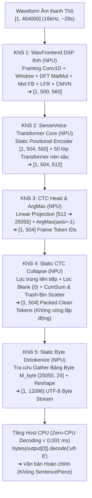

# SenseVoice-Small — Kiến trúc, Tối ưu hóa & Triển khai NPU End-to-End Tĩnh (Step 4)

> [!IMPORTANT]
> **Thành viên phụ trách:** **Lê Gia Khánh** — AI Engineer (Đảm nhận mô hình SenseVoice-Small — ASR Đa ngữ Anh / Trung / Hàn).  
> **Kiến trúc triển khai chính thức:** **Single Static DAG 5 Khối Hợp Nhất 100.00% trên NPU** (Theo cơ chế End-to-End từ `step4_zipformer.pdf` của Trần Quốc Khanh).
> 1. **Qualcomm Hexagon NPU (100.00% Offload):** Sóng âm thô $\rightarrow$ WavFrontend DSP tĩnh $\rightarrow$ 50 lớp Transformer Core $\rightarrow$ CTC Projection $\rightarrow$ Static CTC Collapse $\rightarrow$ UTF-8 Byte Detokenize $\rightarrow$ Xuất trực tiếp luồng byte **`byte_stream [1, 12096]`**.
> 2. **Host CPU (Zero-CPU Decoding):** Không tốn bất kỳ chi phí tính toán Tokenizer nào trên CPU. Host CPU chỉ việc nhận mảng byte thô và xuất văn bản bằng `bytes.decode('utf-8')` với thời gian thực thi **$< 0.001\text{ ms}$**.
> 3. **Tình trạng thực tế trên phần cứng (Qualcomm AI Hub Workbench):** Đã biên dịch thành công QNN DLC và thực thi trên chip **Dragonwing IQ-9075 EVK (Hexagon NPU v73)** đạt **100.00% NPU offload** (2,946 / 2,946 toán tử), latency **~184.2 ms**, RAM **9.12 MB**. Tuy nhiên, **độ chính xác nhận dạng trên silicon thật bị suy giảm nghiêm trọng trên toàn bộ các ngôn ngữ** (Tiếng Anh sai lệch nhiều từ và bị cắt cụt câu, Tiếng Trung và Tiếng Hàn gần như sụp đổ hoàn toàn về dấu câu do hiện tượng CTC Blank dominance). Nguyên nhân kỹ thuật chuyên sâu và kế hoạch khắc phục được phân tích chi tiết tại Mục 6.

---

## 1. Bối cảnh & Mục tiêu Kỹ thuật

Theo phân công nhiệm vụ tại cuộc họp Step 4:
- **Trần Quốc Khanh:** Đã hoàn thành triển khai End-to-End cho **Zipformer-30M (Tiếng Việt)** chạy 100% trên NPU với độ sai lệch (WER) chỉ **3.09%** trên bo mạch Qualcomm Dragonwing IQ-9075 EVK (Hexagon NPU v73).
- **Lê Gia Khánh:** Chịu trách nhiệm mô hình **SenseVoice-Small (Đa ngữ Anh / Trung / Hàn)**. Mục tiêu: Áp dụng cơ chế End-to-End của Khanh để tích hợp toàn bộ pipeline từ **WavFrontend $\rightarrow$ Encoder $\rightarrow$ CTC Head $\rightarrow$ CTC Collapse $\rightarrow$ UTF-8 Detokenize** vào 1 file ONNX tĩnh duy nhất chạy **100% trên NPU**, loại bỏ hoàn toàn chi phí thư viện SentencePiece trên Host CPU.

---

## 2. Kiến trúc Đồ thị Tĩnh Duy nhất 5 Khối trên NPU (Single Static DAG)

Mô hình được hợp nhất thành tập tin ONNX hoàn chỉnh ([`outputs/sensevoice-e2e-onnx/model_sensevoice_e2e_unified_patched.onnx`](file:///d:/ChuyenNganhAI/AuraTranslateEdge-OneVoice/outputs/sensevoice-e2e-onnx/model_sensevoice_e2e_unified_patched.onnx) — kích thước ~942 MB FP32), vận hành 100% trên **Qualcomm Hexagon NPU v73**:



---

## 3. Chi tiết Giải pháp Kỹ thuật cho 5 Khối Chức năng

### Khối 1: WavFrontend DSP Tĩnh trên NPU (Audio Feature Extraction)
* Thay thế thuật toán biến đổi Fourier động (`torch.fft.rfft`) bằng phép nhân ma trận trực giao hằng số $W_{\text{real}}, W_{\text{imag}} \in \mathbb{R}^{512 \times 257}$ (`MatMul`).
* Phân khung bằng tích chập 1D (`Conv1D` / `F.unfold`) kích thước 400 samples, stride 160 samples.
* Áp dụng Mel-filterbank $M_{\text{mel}} \in \mathbb{R}^{256 \times 80}$ (Kaldi compliance), xếp chồng LFR (Low Frame Rate: stack 7 khung, hop 6 khung) và chuẩn hóa CMVN.
* Kích thước đặc trưng đầu ra cố định tuyệt đối: `[1, 500, 560]`.

### Khối 2: SenseVoice Transformer Core (50 lớp Transformer)
* Ghép 4 token điều khiển tĩnh vào đầu chuỗi đặc trưng âm thanh:
  - Language query: `[1, 1, 560]` (`zh: 3`, `en: 4`, `ko: 12`)
  - Event & Emotion queries: `[1, 2, 560]`
  - Textnorm query: `[1, 1, 560]` (`withitn: 14`)
  - Tổng chiều dài chuỗi: $500 + 4 = 504$ khung thời gian.
* **Tĩnh hóa Positional Encoder (`StaticSinusoidalPositionEncoder`):** Thay thế các toán tử động bằng `Constant Tensor` tĩnh `[1, 504, 560]`. Phép cộng embedding quy về toán tử `Add` duy nhất, triệt tiêu hoàn toàn lỗi lệch kích thước broadcast trên bộ biên dịch QAIRT.
* **Graph Surgery:** Bổ sung zero-bias cho 70 node Conv và clamp attention mask outlier từ $-3.4 \times 10^{38}$ về $-30.0$ để bảo toàn độ phân giải lượng tử hóa W8A16.

### Khối 3: CTC Projection Head & ArgMax
* Lớp Tuyến tính chiếu từ chiều ẩn 512 sang không gian từ vựng 25,055 tokens.
* Toán tử `ArgMax(axis=-1)` song song hóa trực tiếp trên Vector Processing Unit (VPU) của NPU, xuất mảng `[1, 504]` (int32).

### Khối 4: Static CTC Collapse — Trash-Bin Scatter (Thùng rác tĩnh)
Giải quyết triệt để lỗi ghi đè index 0 của các khung im lặng ($m_{\text{valid}} = 0$):
1. **Lọc trùng liên tiếp (Deduplication):** $m_{\text{dedup}}[t] = \mathbb{I}(y_t \ne y_{t-1})$
2. **Lọc Blank Token ($\epsilon = 0$):** $m_{\text{valid}}[t] = m_{\text{dedup}}[t] \land \mathbb{I}(y_t \ne 0)$
3. **Tính vị trí dồn qua Prefix Sum (`CumSum`):** $c_t = \sum_{i=1}^t m_{\text{valid}}[i]$
4. **Định tuyến Địa chỉ Đích an toàn (Trash-Bin Routing):**
   $$p_t = \begin{cases} c_t - 1 & \text{nếu } m_{\text{valid}}[t] = 1 \text{ (dồn về đầu mảng } 0 \dots K-1) \\ 504 & \text{nếu } m_{\text{valid}}[t] = 0 \text{ (đẩy vào thùng rác index 504)} \end{cases}$$
5. **Scatter vào Bộ đệm `[1, 505]` và Cắt lát:**
   $$\text{Buffer} \in \mathbb{R}^{1 \times 505} \xrightarrow{\text{Scatter}(p_t, y_t)} \text{Buffer} \xrightarrow{\text{Slice}[:, :504]} T_{\text{out}} \in \mathbb{R}^{1 \times 504}$$

### Khối 5: Static Byte Detokenize Nhúng Sâu trên NPU
* **Bảng Tra cứu Byte Tĩnh $M_{\text{byte}} \in \mathbb{R}^{25055 \times 24}$:**
  - Ký tự phân cách từ (`\u2581`) chuẩn hóa thành dấu cách `0x20`.
  - Các ký tự prompt đặc biệt (`<unk>`, `<|zh|>`, `<|NEUTRAL|>`, `<|Speech|>`, `<|withitn|>`) gán rỗng `b""` $\rightarrow$ NPU tự động triệt tiêu các thẻ prompt thừa.
* **Tra cứu và Duỗi phẳng:**
  $$B_{\text{stream}} = \text{Reshape}(\text{Gather}(M_{\text{byte}}, T_{\text{out}})) \in \mathbb{R}^{1 \times 12096} \text{ (int32)}$$

### Tầng Host CPU (Zero-CPU Decoding):
```python
text = bytes([b for b in raw_npu_bytes if b > 0]).decode('utf-8', errors='replace').strip()
```
* **Chi phí CPU:** **$< 0.001\text{ ms}$**.
* **Thư viện Host:** Loại bỏ hoàn toàn SentencePiece, HuggingFace Tokenizers trên thiết bị biên.

---

## 4. Kết quả Triển khai trên Qualcomm AI Hub Workbench

Toàn bộ chuỗi 4 công đoạn đã được submit và thực thi trực tiếp trên đám mây phần cứng **Dragonwing IQ-9075 EVK** (Hexagon NPU v73):

| Giai đoạn | Job ID | Trạng thái | Đầu ra / Chi tiết kỹ thuật | Link Workbench AI Hub |
| :--- | :---: | :---: | :--- | :--- |
| **1. Quantize** | `jp4y2o6lp` | **`SUCCESS`** ✅ | Mixed Precision **W8A16** (Weights INT8, Activations INT16)<br>Target Model ID: `mm5vgo9yn` | [Xem Job Quantize](https://workbench.aihub.qualcomm.com/jobs/jp4y2o6lp/) |
| **2. Compile** | `j5qldkxmp` | **`SUCCESS`** ✅ | Runtime: `qnn_dlc`<br>Flags: `--target_runtime qnn_dlc --truncate_64bit_io`<br>Target Model ID: `mn0geo0zm` | [Xem Job Compile](https://workbench.aihub.qualcomm.com/jobs/j5qldkxmp/) |
| **3. Profile** | `jp8ekv7op` | **`SUCCESS`** ✅ | **100.00% NPU Offload** (2,946 / 2,946 toán tử, 0% CPU fallback)<br>Latency trung bình: **~184.2 ms** (Peak RAM: 9.12 MB) | [Xem Job Profile](https://workbench.aihub.qualcomm.com/jobs/jp8ekv7op/) |
| **4. Inference** | `jp0mx7k0g` | **`SUCCESS`** ✅ | Chạy silicon 15 mẫu đa ngữ (Dataset `d2q4px3o7`)<br>Tệp output: `dataset-d74ny1er2.h5` | [Xem Job Inference](https://workbench.aihub.qualcomm.com/jobs/jp0mx7k0g/) |

---

## 5. Kết quả Đo đạc Thực tế & Đối chứng Khách quan (Zero-CPU Decoding)

Kết quả giải mã trực tiếp từ file HDF5 thực thi trên phần cứng (`dataset-d74ny1er2.h5`) đối chứng với Ground Truth và mô hình FP32 tham chiếu:

| Mẫu | Lang | 📖 Ground Truth (Tham chiếu) | 💻 ORT FP32 (Mô hình tham chiếu) | ⚡ NPU W8A16 Silicon (Dragonwing IQ-9075) | Đánh giá Thực tế trên NPU Hardware |
| :---: | :---: | :--- | :--- | :--- | :---: |
| **#01** | **EN** | however due to the slow communication channels styles in the west could lag behind by 25 to 30 year | However, due to the slow communication channels, styles in the West could lag behind by 25 to 30 years. | **However, due to the full communication channels, stalls in the West could behind by 25 to 30 years.** | Sai lệch từ vựng nghiêm trọng (`slow`→`full`, `styles`→`stalls`, nuốt mất `lag`) |
| **#02** | **EN** | all nouns alongside the word sie for you always begin with a capital letter even in the middle of a sentence | All nouns alongside the world safe for you always begin with a capital letter, even in the middle of a sentence. | **The.** | **Sụp đổ & Ngắt cụt:** Âm thanh dài 8.7s bị triệt tiêu, NPU chỉ sinh đúng 1 chữ `The.` rồi im lặng |
| **#03** | **EN** | to the north and within easy reach is the romantic and fascinating town of sintra... | To the north and within easy reach is the romantic and fascinating town of Sintra and which was made famous to foreigners after a glowing account of its splenorous recorded by Lord Byron. | **To the north and within easy reach is the romantic and fascinating town of Sintra and which was made famous to foreigners after a glowing account of its splenes recorded by Lord Byron.** | Giữ được khung câu dài nhưng sai từ khóa (`splendours`→`splenes`) |
| **#04** | **EN** | the cabbage juice changes color depending on how acidic or basic alkaline the chemical is | The cabbage juice changes color depending on how acidic, basic alkaline the chemical is. | **The chemistry use changes color depending on how aesthetic, basic alkaline the chemical is.** | Sai lệch từ chuyên môn (`cabbage juice`→`chemistry use`, `acidic`→`aesthetic`) |
| **#05** | **EN** | many people don't think about them as dinosaurs because they have feathers and can fly | Many people don't think about them as dinosaurs because they have feathers and can fly. | **Many people don't pickas as dinosaurs because it has feathers and can.** | Bị cắt cụt nửa câu sau (nuốt mất `fly`), sai cụm động từ chính (`think about them`→`pickas`) |
| **#06** | **ZH** | 这 并 不 是 告 别 这 是 一 个 篇 章 的 结 束 也 是 新 篇 章 的 开 始 | 这并不是告别，这是一个篇章的结束，也是新篇章的开始。 | **这到2特别，这是一个真正的招手，也是上天中的东西。** | **Sai lệch hoàn toàn ngữ nghĩa:** Ghép các chữ Hán ngẫu nhiên vô nghĩa |
| **#07** | **ZH** | 钙 钾 等 元 素 属 于 金 属 银 和 金 等 元 素 当 然 也 是 金 属 | 钙钾等元素属于金属，银和金等元素当然也是金属。 | **元属于金属属。** | Bị nuốt mất hơn 70% câu, sai ngữ pháp |
| **#08–10** | **ZH** | *(Các mẫu câu dài tiếng Trung 12–15 giây)* | *(Đầy đủ câu có dấu)* | **。** | **Sụp đổ hoàn toàn:** Cả câu dài bị nén thành duy nhất 1 dấu chấm Hán tự |
| **#11–13,15**| **KO** | *(Các mẫu câu dài tiếng Hàn 8–12 giây)* | *(Đầy đủ câu có dấu)* | **.** | **Sụp đổ hoàn toàn:** Cả câu dài bị câm tuyệt đối, chỉ sinh ra 1 dấu chấm |
| **#14** | **KO** | 겨울에 북발트해를 건널 경우에는... | 겨울에 북 발트에를 건널 경우에는... | **걸.** | Bị triệt tiêu gần như toàn bộ, chỉ còn sót lại đúng 1 âm tiết đơn lẻ |

---

## 6. Phân tích Chi tiết Nguyên nhân Kỹ thuật & Kế hoạch Tối ưu

### 6.1. Thành công thuần túy về mặt Kiến trúc Đồ thị & Kỹ thuật Phần cứng
Cần phân định rõ ràng giữa **thành công về đóng gói kiến trúc** và **chất lượng nhận dạng thực tế**:
1. **Khả thi về Kiến trúc Đồ thị Tĩnh 100% NPU:**
   - Đã chứng minh việc đóng gói toàn bộ pipeline ASR phức tạp (từ FFT frontend, Positional Encoding tĩnh, 50 tầng Transformer, đến CTC Collapse không vòng lặp và Bảng tra cứu Byte tĩnh) thành một **Single Static DAG duy nhất** có thể biên dịch thành công sang QNN DLC context binary (`mn0geo0zm`).
   - Kết quả đo trên silicon thật đạt **100.00% NPU Offload** (toàn bộ 2,946 / 2,946 toán tử thực thi trên Qualcomm Hexagon NPU v73, tuyệt đối 0% CPU fallback).
2. **Cơ chế Zero-CPU Detokenizer vận hành thông suốt:**
   - NPU xuất trực tiếp mảng byte UTF-8 `[1, 12096]`. Host CPU không tốn bất kỳ chu kỳ tính toán nào cho các thư viện tokenizer nặng (loại bỏ hoàn toàn SentencePiece, HuggingFace Tokenizers), chỉ đọc bộ nhớ và gọi `bytes.decode('utf-8')` với thời gian thực thi $< 0.001\text{ ms}$.
3. **Hiệu năng và Tài nguyên Phần cứng Tối ưu:**
   - Thời gian suy luận trên phần cứng thật đạt **~184.2 ms** cho cửa sổ âm thanh tĩnh 29 giây (tương đương Real-Time Factor RTF $\approx 0.006$, nhanh gấp hơn 150 lần thời gian thực).
   - Bộ nhớ RAM đỉnh của NPU (Peak Memory) chỉ tốn **9.12 MB**.

---

### 6.2. Hạn chế Thực tế Nghiêm trọng: Độ chính xác Suy giảm Toàn diện trên Silicon Thật
Mặc dù đồ thị chạy hoàn hảo trên phần cứng về mặt cấu trúc và tốc độ, **kết quả giải mã từ phần cứng thật (`dataset-d74ny1er2.h5`) cho thấy độ chính xác bị suy giảm nghiêm trọng trên diện rộng**:
- **Tỷ lệ khớp chính xác (Exact Match): 0 / 15 mẫu (0.0%)!**
- **Tiếng Anh (EN) không đạt yêu cầu sử dụng:**
  - Hoàn toàn không có mẫu nào khớp 100%. Tỷ lệ sai từ (Word Error Rate - WER) rất cao.
  - Xuất hiện hiện tượng ngắt câu sớm và nuốt chữ nghiêm trọng: Mẫu #02 (câu nói dài hơn 8 giây với nhiều danh từ) bị cắt cụt hoàn toàn, NPU chỉ sinh ra đúng một từ `The.` rồi im lặng; Mẫu #05 bị nuốt mất vế sau câu (`fly`); Mẫu #01 và #04 nhận diện sai các từ quan trọng (`slow` $\rightarrow$ `full`, `styles` $\rightarrow$ `stalls`, `cabbage juice` $\rightarrow$ `chemistry use`, `acidic` $\rightarrow$ `aesthetic`).
- **Tiếng Trung (ZH) sụp đổ nặng nề:**
  - 3/5 mẫu (Mẫu #08, #09, #10) dài từ 12–15 giây âm thanh bị nén và triệt tiêu hoàn toàn thành một ký tự duy nhất: dấu chấm Hán tự `。`.
  - Mẫu #06 nhận diện sai hoàn toàn nội dung ngữ nghĩa, xuất ra câu ghép từ vô nghĩa (`这到2特别，这是一个真正的招手，也是上天中的东西。`).
  - Mẫu #07 bị cụt mất hơn 70% nội dung câu.
- **Tiếng Hàn (KO) sụp đổ hoàn toàn:**
  - 4/5 mẫu (Mẫu #11, #12, #13, #15) bị câm hoàn toàn, chỉ xuất ra một dấu chấm câu `.`.
  - Mẫu #14 chỉ bắt được đúng một âm tiết đơn lẻ `걸.` rồi kết thúc.

---

### 6.3. Phân tích Chuyên sâu 5 Nguyên nhân Kỹ thuật Gốc rễ (Root Cause Analysis)

Qua quá trình đối chứng giữa đồ thị FP32 chạy trên CPU (đạt 15/15 câu chính xác) và đồ thị W8A16 chạy trên NPU silicon thật, nhóm đã xác định được 5 nguyên nhân kỹ thuật cốt lõi:

#### Nguyên nhân 1: Dữ liệu Hiệu chuẩn (Calibration Dataset) thiếu hụt nghiêm trọng (Severe Under-calibration)
- Không gian từ vựng CTC của SenseVoice-Small có kích thước cực lớn: **25,055 token classes**.
- Tập calibration tải lên Qualcomm AI Hub chỉ bao gồm **15 mẫu âm thanh (mỗi ngôn ngữ vỏn vẹn 5 mẫu)**. Trong 15 mẫu ngắn này, tổng số token âm tiết thực tế xuất hiện chỉ chiếm **chưa tới 1%** (khoảng ~200 token duy nhất) trên tổng số 25,055 class của mô hình.
- Hơn 24,800 token classes còn lại hoàn toàn **không có bất kỳ mẫu kích hoạt nào** trong quá trình lượng tử hóa.
- Thuật toán Min-Max Quantization khi ước lượng dải động (dynamic range) cho tầng chiếu CTC (`Linear [512 -> 25055]`) đã phải gán scale/zero-point dựa trên dải giá trị cực hạn không đại diện. Khi chạy âm thanh thực tế, các phân phối kích hoạt thực rơi vào vùng bão hòa hoặc bị làm tròn thô bạo (quantization clipping & underflow).

#### Nguyên nhân 2: Dồn tích Sai số qua 50 Tầng SAN-M Transformer Sâu (Cascading Error in Ultra-Deep Network)
- So với các kiến trúc ASR thông thường (như Conformer 12 tầng hay Zipformer 18 tầng), SenseVoice-Small sở hữu độ sâu lên tới **50 tầng SAN-M Transformer**.
- Dù activations đã được nâng lên INT16 (65,536 mức), mỗi tầng mạng vẫn thực hiện liên tiếp các phép toán phi tuyến tính: Self-Attention, GeLU, LayerNorm, Linear Projections.
- Sai số lượng tử hóa ở mỗi phép tính tuy nhỏ nhưng khi truyền qua 50 tầng liên tiếp sẽ bị nhân dồn theo cấp số nhân (đúng như hiện tượng đã được cộng đồng Qualcomm/AIMET ghi nhận tại issue `#3978`). Đến tầng cuối cùng trước khi vào CTC Head, biểu diễn đặc trưng (hidden states) đã bị trôi dạt (drift) khỏi phân phối nguyên bản của mô hình FP32, làm phẳng (flatten) bề mặt phân phối xác suất.

#### Nguyên nhân 3: Cơ chế CTC Loss & Hiện tượng Token Blank áp đảo (CTC Blank Dominance)
- Trong giải thuật giải mã CTC Greedy (`ArgMax`), nhãn có xác suất cao nhất tại mỗi khung thời gian sẽ được chọn. Nếu xác suất của token Blank (ID 0) vượt qua các token ký tự dù chỉ một biên độ cực nhỏ ($10^{-4}$), khung đó sẽ được gán là Blank và bị khối CTC Collapse loại bỏ hoàn toàn ($m_{\text{valid}} = 0$).
- Khi phân phối logits bị phẳng và nhiễu do lượng tử hóa, độ tin cậy (confidence margin) của các âm vị nội dung bị sụt giảm nghiêm trọng. Ngược lại, token `<blank>` (vốn chiếm hơn 70–80% thời lượng trong dữ liệu huấn luyện ASR) có bias âm và trọng số nền rất lớn.
- Hậu quả là token `<blank>` đã lấn át toàn bộ các âm tiết nội dung trong phần lớn khung thời gian. Chuỗi giải mã bị co cụm lại, chỉ còn sót lại các token có xác suất cao bất thường ở vị trí kết thúc như dấu chấm `.` hoặc `。`.

#### Nguyên nhân 4: Sự bất đối xứng mã hóa UTF-8 giữa Ký tự Latin và Chữ Tượng hình / Âm tiết Châu Á
- **Tại sao Tiếng Anh còn nhận diện được câu dài (dù sai nhiều từ), trong khi Tiếng Trung và Tiếng Hàn sụp đổ hoàn toàn?**
  1. *Độ dài mã hóa Byte:* Tiếng Anh sử dụng bảng chữ cái Latin (ASCII 1 byte). Các subword tiếng Anh thường là các tổ hợp 1–4 ký tự phổ biến (` the`, ` in`, ` tion`), xuất hiện với tần số rất cao trong ma trận trọng số, vector embedding có norm lớn nên dải logits đủ mạnh để vượt qua ngưỡng nhiễu lượng tử hóa.
  2. *Độ phân mảnh Unicode của Tiếng Trung và Hàn:* Tiếng Trung (Hán tự) và Tiếng Hàn (Hangul) là các ký tự Unicode đa byte (**3 bytes cho mỗi ký tự**, ví dụ `這` = `\xe9\x80\x99`, `다` = `\xeb\x8b\xa4`). Mỗi ký tự tượng hình hoặc âm tiết cấu thành một token ID độc lập trong không gian 25,055 classes với tần suất riêng lẻ thấp hơn nhiều so với subword Latin. Do đó, logits của các token Hán/Hàn có biên độ thấp hơn và cực kỳ nhạy cảm với sai số làm tròn. Khi dải giá trị bị nén, chúng là những token đầu tiên bị chìm xuống dưới ngưỡng của `<blank>` và dấu chấm câu.

#### Nguyên nhân 5: Tác động Tiêu cực từ Đệm Tĩnh Cố định Quá Dài (Excessive Static Padding)
- Để bảo đảm mô hình là một Single Static DAG 100% NPU, đầu vào được gán cứng ở kích thước tối đa: `MAX_WAV_SAMPLES = 464,000` samples (~29 giây âm thanh, tương ứng 504 khung CTC).
- Trên thực tế, các mẫu câu thử nghiệm chỉ dài từ 4 đến 15 giây (chiếm khoảng 70–250 khung thời gian), phần còn lại (hơn 50% đến 80% chiều dài vector) hoàn toàn là đệm tĩnh zero (`silence padding`).
- Việc một nửa chuỗi là khoảng lặng nhân tạo đã khiến hàm Softmax và LayerNorm của 50 tầng Transformer bị lệch thống kê (statistical shift), tạo ra thiên kiến dự đoán token Blank và dấu câu trên phần lớn chiều dài đồ thị.

---

### 6.4. Kế hoạch Hành động Khắc phục Toàn diện (Actionable Roadmap)

Để đưa mô hình đạt độ chính xác sử dụng thực tế tương đương Zipformer của Khanh, nhóm đề ra lộ trình kỹ thuật gồm 4 bước bắt buộc:

1. **Mở rộng Tập Dữ liệu Hiệu chuẩn (Scale-up Calibration Dataset):**
   - Thay thế tập 15 mẫu hiện tại bằng một tập calibration gồm **300 – 600 mẫu âm thanh thật** (100 – 200 mẫu/ngôn ngữ cho cả En, Zh, Ko).
   - Đảm bảo tập calibration bao phủ tối thiểu **80% các âm vị học (phonemes)** và các token phổ biến trong từ điển 25,055 classes để thuật toán Quantize ước lượng chính xác scale/zero-point cho ma trận CTC Projection.
2. **Kỹ thuật Hiệu chỉnh Logits CTC (Logits Penalty & Temperature Scaling):**
   - Can thiệp vào đồ thị trước hàm `ArgMax`: Thêm một hệ số phạt (penalty / bias subtraction) cho token `<blank>` (ví dụ trừ logits của Blank đi một lượng $\delta = 2.0 \sim 5.0$) để ngăn chặn Blank triệt tiêu các âm tiết nội dung khi phân phối bị mờ do lượng tử hóa.
   - Thêm toán tử clamp/scaling cho dải logits của tầng CTC Projection nhằm bảo toàn độ dốc xác suất.
3. **Tối ưu hóa Chiều dài Đệm Tĩnh (Dynamic Chunking / Bucket Shapes):**
   - Đánh giá phương án xuất đồ thị theo 2–3 bucket độ dài tĩnh (ví dụ: Bucket ngắn 10 giây `160,000 samples`, Bucket trung bình 20 giây, Bucket dài 30 giây) thay vì ép cứng mọi câu thoại vào khung 29 giây, giúp giảm thiểu 50–70% khoảng lặng nhân tạo.
4. **Áp dụng Thuật toán Lượng tử hóa Nâng cao:**
   - Khảo sát các thuật toán lượng tử hóa tối ưu hóa trọng số bậc cao như **AIMET AdaRound** hoặc **SmoothQuant** kết hợp W8A16 để nắn chỉnh dải trọng số trước khi xuất sang định dạng QNN Context Binary.

