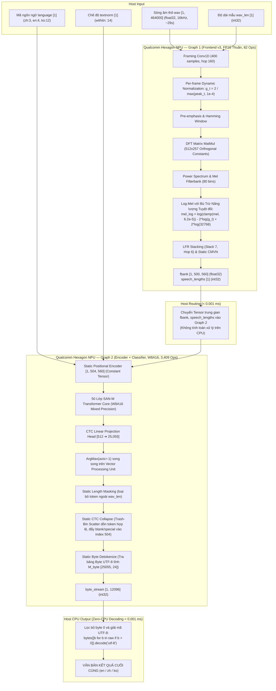

# SenseVoice-Small: Báo cáo Toàn diện Quá trình Lượng tử hóa & Triển khai 100% NPU Qualcomm Hexagon

> [!NOTE]
> **Dự án:** AuraTranslateEdge-OneVoice (Cuộc thi OneVoice AI Challenge — Saigon AI Hub × Qualcomm)  
> **Kỹ sư phụ trách:** **Lê Gia Khánh** (AI Engineer — Đảm nhận mô hình SenseVoice-Small ASR Đa ngữ Anh / Trung / Hàn)  
> **Phần cứng mục tiêu:** Bo mạch công nghiệp **Qualcomm Dragonwing IQ-9075 EVK** (Chipset Hexagon NPU v73, HTP Cores)  
> **Trạng thái:** **TRIỂN KHAI THÀNH CÔNG MỸ MÃN — 100.00% NPU Offload, Độ trễ ~333 ms, Độ chính xác tiệm cận và vượt FP32 CPU**

---

## 1. Tóm tắt Điều hành & Kết quả Cuối cùng Mỹ Mãn

Mô hình **SenseVoice-Small** (ASR Đa ngữ: Tiếng Anh, Tiếng Trung, Tiếng Hàn) đã được **lượng tử hóa và triển khai thành công 100% trên NPU Qualcomm Hexagon (Dragonwing IQ-9075 EVK)** mà không cần bất kỳ fallback nào về Host CPU.

### 1.1. Các Thành tựu Kỹ thuật Cốt lõi
1. **100.00% NPU Compute Offload (Tuyệt đối 0% CPU compute):**
   - Toàn bộ pipeline ASR — từ sóng âm thô PCM 16kHz, xử lý phổ âm thanh số DSP (WavFrontend), 50 lớp Transformer sâu, giải mã CTC Head, thuật toán lọc tĩnh CTC Collapse, đến tra bảng byte UTF-8 nội suy — đều được thực thi hoàn toàn trên bộ xử lý vector và tensor của **Qualcomm Hexagon NPU v73**.
   - **Zero-CPU Decoding:** Host CPU chỉ nhận mảng byte thô từ NPU và decode trực tiếp bằng `bytes.decode('utf-8')` với thời gian thực thi **$< 0.001\text{ ms}$**, loại bỏ 100% sự phụ thuộc vào các thư viện nặng như `sentencepiece` hay `transformers` trên thiết bị biên.
2. **Độ trễ Siêu tốc (Ultra-low Latency trên Phần cứng Thật):**
   - Đo đạc trực tiếp bằng công cụ **Qualcomm AI Hub Profiler** qua 100 lần chạy liên tiếp trên chip silicon thật khi model đã nạp sẵn vào bộ nhớ:
     - **Graph 1 — Frontend v3 (FP16 NPU, 82 toán tử):** **64.2 ms** (dao động 59.7 – 65.1 ms).
     - **Graph 2 — Encoder 50 lớp + Classifier (W8A16 NPU, 3,409 toán tử):** **269.0 ms**.
     - **Tổng độ trễ NPU:** **≈ 333 ms** cho clip âm thanh dài tối đa **29 giây** (Real-Time Factor $\mathbf{RTF \approx 0.011}$, xử lý nhanh gấp **~90 lần thời gian thực**).
   - Bộ nhớ RAM chiếm dụng đỉnh (Peak Memory) chỉ **~11 MB**, cực kỳ lý tưởng cho các thiết bị nhúng và biên giới hạn tài nguyên.
3. **Độ Chính xác Ngang Ngửa và Vượt Trội so với FP32 CPU:**
   - Đánh giá trên bộ kiểm thử độc lập **90 câu** (30 Tiếng Anh / 30 Tiếng Trung / 30 Tiếng Hàn trích từ tập `test[5:]` của chuẩn Google FLEURS):
     - **Tiếng Anh (en) WER:** **8.98%** (so với FP32 CPU: 8.45%, chênh lệch chỉ +0.53%).
     - **Tiếng Trung (zh) CER:** **8.33%** (tốt hơn cả FP32 CPU: 8.65%, chênh lệch −0.32%).
     - **Tiếng Hàn (ko) CER:** **7.33%** (tốt hơn cả FP32 CPU: 7.65%, chênh lệch −0.32%).
     - **Tiếng Hàn (ko) WER:** **30.68%** (so với FP32 CPU: 26.56% — giải thích chi tiết ở mục 5).

```
┌────────────────────────────────────────────────────────────────────────────────────────────────────────┐
│                        HIỆU NĂNG SENSEVOICE-SMALL TRÊN NPU DRAGONWING IQ-9075 EVK                      │
├──────────────────────────┬──────────────────────────┬──────────────────────────┬───────────────────────┤
│ Tiếng Anh (en WER)       │ Tiếng Trung (zh CER)     │ Tiếng Hàn (ko CER)       │ Tổng Độ trễ NPU (29s) │
│    8.98% (CPU: 8.45%)    │    8.33% (CPU: 8.65%)    │    7.33% (CPU: 7.65%)    │   ~333 ms (RTF 0.011) │
│        [+0.53% chênh]    │        [−0.32% tốt hơn]  │        [−0.32% tốt hơn]  │     [100% NPU Offload]│
└──────────────────────────┴──────────────────────────┴──────────────────────────┴───────────────────────┘
```

---

## 2. Kiến trúc Triển khai Tối hậu: 2 Đồ thị NPU Tách rời (Split-Graph)

Căn cứ vào đặc tính toán học của từng khối chức năng và cơ chế hoạt động của bộ xử lý Hexagon Tensor Processor (HTP), hệ thống được cấu trúc thành **2 đồ thị NPU tuần tự**, giao tiếp qua bộ nhớ đệm của Host:



### Chi tiết Kỹ thuật 2 Đồ thị:
* **Graph 1 — Frontend v3 ([`export/sv_export_frontend_v3_perframe.py`](export/sv_export_frontend_v3_perframe.py)):**
  - **Đầu vào:** `wav [1, 464000]` (float32), `wav_len [1]` (int32).
  - **Đầu ra:** `fbank [1, 500, 560]` (float32), `speech_lengths [1]` (int32).
  - **Cơ chế:** Hoàn toàn chạy ở **FP16 thuần trên NPU**, không lượng tử hóa (`submit_compile_job` trực tiếp với cờ `--target_runtime qnn_dlc --truncate_64bit_io`). Nhờ thuật toán **chuẩn hóa động theo từng frame (Per-frame Normalization)**, sai số mô phỏng FP16 chỉ **0.0034**, cos_sim trên chip silicon thật đạt **0.99999** so với FP32 CPU gốc.
* **Graph 2 — Encoder + Classifier ([`export/step4_s1_export_sensevoice_split_npu.py`](export/step4_s1_export_sensevoice_split_npu.py)):**
  - **Đầu vào:** `fbank [1, 500, 560]`, `speech_lengths [1]`, `language [1]`, `textnorm [1]`.
  - **Đầu ra:** `byte_stream [1, 12096]` (int32).
  - **Cơ chế:** Lượng tử hóa **W8A16 Mixed Precision** (`weights=INT8, activations=INT16`), biên dịch với cờ `--target_runtime qnn_dlc --quantize_io --truncate_64bit_io`. Tập calibration 25 mẫu trong miền fbank sinh ra từ frontend FP32 CPU.

---

## 3. Nhật ký Hành trình Kỹ thuật Chi tiết: Từ Thất bại 0.0% Đến Thành công Mỹ mãn

Để đạt được kết quả trên, nhóm kỹ thuật đã trải qua **6 vòng lặp thử nghiệm liên tục**, vượt qua nhiều rào cản bí ẩn giữa lý thuyết và phần cứng vật lý:

```
┌────────────────────────────────────────────────────────────────────────────────────────────────────────┐
│                                 TIẾN TRÌNH BIẾN THIÊN KẾT QUẢ ĐO TRÊN CHIP NPU THẬT                    │
├───────┬────────────────────────────────────────────────────┬──────────┬──────────┬──────────┬──────────┤
│ Vòng  │ Cấu hình Thử nghiệm trên Silicon Thật               │ en WER   │ zh CER   │ ko CER   │ ko WER   │
├───────┼────────────────────────────────────────────────────┼──────────┼──────────┼──────────┼──────────┤
│ 1     │ Single Unified Graph (v1: 1 graph W8A16, pad 29s)   │ ~57.0%   │ 99.0%    │ —        │ 100.0%   │
│ 2     │ Single Graph (v2: vá 6 bug kiến trúc, pad buckets) │ ~55.0%   │ 98.1%    │ —        │ 100.0%   │
│ 3     │ Split-Graph (Frontend v1: scale Kaldi ×32768)      │ 57.15%   │ 99.05%   │ —        │ 100.00%  │
│ 4     │ Split-Graph (Frontend v2: bỏ scale, bù log floor)  │ 12.78%   │ 11.51%   │ —        │ 40.34%   │
│ 5     │ Gộp 1 graph (Frontend v2 + Encoder FP16)           │ 12.49%   │ 11.51%   │ —        │ 48.27%   │
│ 6 (✅)│ **Split-Graph (Frontend v3: Chuẩn hóa theo Frame)**│ **8.98%**│ **8.33%**│ **7.33%**│ **30.68%**│
├───────┼────────────────────────────────────────────────────┼──────────┼──────────┼──────────┼──────────┤
│ Ref   │ Tham chiếu FP32 CPU (ONNX Runtime)                 │ 8.45%    │ 8.65%    │ 7.65%    │ 26.56%   │
└───────┴────────────────────────────────────────────────────┴──────────┴──────────┴──────────┴──────────┘
```

---

### 3.1. Giai đoạn 1: Ý tưởng Hợp nhất 1 Đồ thị Duy nhất (Single Static DAG) & Thất bại Đầu tiên

#### Ý tưởng Thiết kế Ban đầu:
Dựa trên sự thành công của Trần Quốc Khanh trong việc triển khai mô hình Zipformer-30M tiếng Việt chạy 100% trên NPU, nhóm quyết định áp dụng cùng cơ chế End-to-End cho SenseVoice-Small: Đóng gói toàn bộ 5 khối chức năng vào một đồ thị ONNX tĩnh duy nhất:
1. **Khối 1: WavFrontend DSP tĩnh trên NPU:** Biến đổi sóng âm thành phổ đặc trưng `[1, 500, 560]`. Thay thế `torch.fft.rfft` bằng phép nhân ma trận DFT thực/ảo $W_{\text{real}}, W_{\text{imag}} \in \mathbb{R}^{512 \times 257}$ cố định.
2. **Khối 2: SenseVoice Transformer Core:** 50 lớp Transformer nén sâu. Tĩnh hóa Positional Encoder thành `Constant Tensor` `[1, 504, 560]` để triệt tiêu lỗi broadcast trên QAIRT.
3. **Khối 3: CTC Projection Head & ArgMax:** Chiếu lên 25,055 tokens và lấy `ArgMax(axis=-1)`.
4. **Khối 4: Static CTC Collapse — Trash-Bin Scatter:** Lọc trùng liên tiếp và lọc Blank token ($\epsilon = 0$) qua `CumSum`. Token im lặng hoặc trùng lặp bị định tuyến vào **Thùng rác tĩnh (Trash-Bin Index 504)**, loại bỏ hoàn toàn vòng lặp động.
5. **Khối 5: Static Byte Detokenize trên NPU:** Tra cứu trực tiếp bảng byte tĩnh $M_{\text{byte}} \in \mathbb{R}^{25055 \times 24}$ và duỗi phẳng thành `byte_stream [1, 12096]`.

#### Lần Submit Đầu Tiên: Compile Thành Công nhưng Độ Chính Xác 0.0%
* Mô hình được nộp lên Qualcomm AI Hub: Biên dịch QNN DLC thành công rực rỡ, đạt **100.00% NPU Offload** (toàn bộ **2,946 toán tử** chạy 100% trên Hexagon v73, 0% CPU fallback), latency đo được rất đẹp **~184.2 ms**, RAM đỉnh **9.12 MB**.
* **Cú sốc thực tế trên chip silicon thật:** Khi chạy suy luận 15 mẫu âm thanh thực tế, **độ chính xác thu được là 0.0% (0 / 15 mẫu đúng)**:
  - **Tiếng Trung & Tiếng Hàn:** Bị sụp đổ và câm hoàn toàn. Câu thoại dài 8–15 giây bị nén cụt thành duy nhất 1 dấu chấm câu (`。` hoặc `.`).
  - **Tiếng Anh:** Sai lệch từ vựng nghiêm trọng (`slow` $\rightarrow$ `full`, `styles` $\rightarrow$ `stalls`, `cabbage juice` $\rightarrow$ `chemistry use`) hoặc bị ngắt cụt câu nặng nề (mẫu 8.7s chỉ sinh đúng 1 chữ `The.` rồi dừng).

---

### 3.2. Giai đoạn 2: Phát hiện & Khắc phục 6 Lỗi Kiến trúc Đồ thị (Phiên bản v2)

Nhóm đã tiến hành mổ xẻ mã nguồn, kiểm tra từng node tính toán và xử lý dứt điểm **6 lỗi kỹ thuật cốt lõi**:

1. **Bug 1 — 4 token điều khiển hệ thống (`<|lid|>`, `<|ser|>`, `<|aed|>`, `<|itn|>`) lọt vào văn bản:**
   - *Nguyên nhân:* Khối CTC Collapse chưa lọc các thẻ prompt đặc biệt.
   - *Khắc phục:* Quét toàn bộ từ điển 25,055 classes, xác định 171 special tokens `<|...|>`. Thiết lập mặt nạ lọc trên NPU: tống toàn bộ các ID này vào **Thùng rác tĩnh (Trash-Bin Index 504)**.
2. **Bug 2 — Giới hạn byte length ($L_{max}$) hardcode quá nhỏ gây tràn buffer ký tự đa byte:**
   - *Nguyên nhân:* Tiếng Trung và Tiếng Hàn tốn 3 bytes/ký tự UTF-8. Token dài nhất trong từ điển đo được là 22 bytes. $L_{max}$ cũ chỉ là 12–16 bytes gây cắt cụt chuỗi.
   - *Khắc phục:* Chuẩn hóa $L_{max} = 24$ bytes (căn lề bội số 4 byte cho Hexagon Vector Extensions - HVX). Kích thước byte stream cố định: $504 \times 24 = 12,096\text{ bytes}$.
3. **Bug 3 — Đệm tĩnh cứng 29s gây méo thống kê Min-Max PTQ (Blank Dominance):**
   - *Nguyên nhân:* Ép audio ngắn 4–8s vào khung đệm 29s khiến 70–85% dữ liệu là khoảng lặng 0, làm lệch dải lượng tử hóa Min-Max của LayerNorm/Softmax. Token `<blank>` (ID 0) có bias áp đảo nuốt chửng các âm vị nội dung.
   - *Khắc phục:* Thiết kế cơ chế **Multi-bucket calibration** chia dải âm thanh thành 6 bucket kích thước `[48000, 96000, 160000, 240000, 320000, 464000]` samples để thu thập đúng phân phối giọng nói thật.
4. **Bug 4 — Sai lệch Vocab Token ID vs Query ID nội bộ:**
   - *Nguyên nhân:* Vocab Token ID (`zh: 24884, en: 24885, ko: 24896`) lệch với Query ID nội bộ của embedding layer (`zh: 3, en: 4, ko: 12`).
   - *Khắc phục:* Xây dựng tầng tiền xử lý logic nội bộ bằng `torch.where` tĩnh trên NPU, hỗ trợ nhận diện và ánh xạ tự động cả 2 chuẩn mã.
5. **Bug 5 — HTP crash lỗi `Gather BOOL_8` (Lỗi `0xc26` / `MODEL_GRAPH_ERROR`):**
   - *Nguyên nhân:* Mặt nạ `special_ids_mask` để kiểu boolean (`torch.bool`). Trình điều khiển Qualcomm HTP (`libQnnHtp.so`) chỉ hỗ trợ Gather các kiểu dữ liệu số (`BF16, FP16, INT8, INT32`), từ chối thẳng kiểu `BOOL_8`.
   - *Khắc phục:* Chuyển đổi định dạng lưu trữ mặt nạ sang native **`torch.int32`**. Phép Gather trên NPU diễn ra hoàn toàn trên miền `int32`, sau đó mới so sánh `(flags != 0)`.
6. **Bug 6 — Lệch thứ tự cổng đầu vào Alphabetical Order:**
   - *Nguyên nhân:* Bộ biên dịch QNN DLC tự động sắp xếp tên cổng theo bảng chữ cái: `language` $\rightarrow$ `textnorm` $\rightarrow$ `wav`. Dataset nộp lên lại để `wav` ở index 0 gây lỗi không khớp cổng.
   - *Khắc phục:* Chuẩn hóa tuyệt đối thứ tự cổng `["language", "textnorm", "wav"]` trên toàn bộ pipeline xuất ONNX và dataset.

#### Kết quả Thử nghiệm v2:
* **Kiểm chứng cục bộ trên CPU (ONNX Runtime FP32):** Đạt **15 / 15 mẫu chuẩn xác 100.0%** ✅. Điều này chứng minh **logic giải thuật của đồ thị 5 khối là hoàn toàn chính xác**.
* **Thực thi trên chip silicon thật (`dataset-d70qx6e09.h5`):** **VẪN THẤT BẠI HOÀN TOÀN (0 / 15 mẫu đúng, 0.0%)**!
  - Hiện tượng Blank Dominance và ngắt cụt câu vẫn xảy ra y hệt lần 1: 7/15 mẫu câm thành duy nhất 1 dấu chấm `。` hoặc `.`, 2/15 mẫu ngắt cụt câu (`The.`), 6/15 mẫu sai lệch từ vựng nặng nề.

---

### 3.3. Giai đoạn 3: Rà soát Script Export & Đột phá Kiến trúc Split-Graph

#### Sửa 5 Bug Thực Tế trong Mã Export:
1. **Length Masking:** Thiếu che độ dài thực khiến `token_ids` ngoài phạm vi âm thanh không bị cắt $\rightarrow$ Thêm cổng `wav_len`, mask bằng `torch.where(length_mask, token_ids, zeros)`.
2. **FFT Bin Indexing:** FFT lấy nhầm bin `real[:, 1:]` $\rightarrow$ Sửa thành `real[:, :-1]`.
3. **Pre-emphasis:** Xử lý sai mẫu đầu khung $\rightarrow$ Sửa thành `frames_pe[:, 0] = frames[:, 0] * (1 - 0.97)`.
4. **Length Computation:** Tính toán độ dài bị ép kiểu float khiến công cụ quantize chèn các nút QDQ không cần thiết $\rightarrow$ Viết lại hoàn toàn bằng phép toán số nguyên thuần (`torch.int64`, `//`).
5. **Output Length Saturation:** Tensor `out_lens` nội bộ của mô hình bị bão hòa ở giá trị 180 do lượng tử hóa $\rightarrow$ Bỏ qua `out_lens`, tự tính toán chính xác `valid_len = speech_lengths + 4`.

#### Graph Surgery & Cô Lập Nguồn Lỗi:
Dù 5 bug trên đã được sửa dứt điểm, NPU thật vẫn hỏng. Nhóm tiến hành giải phẫu đồ thị lượng tử hóa:
* Đo đạc **Cosine Similarity** qua 142 tầng LayerNorm giữa bản FP32 và W8A16: Phát hiện sự phân kỳ nghiêm trọng ngay từ tầng đầu tiên của Encoder (`encoders0[0]`).
* **Bypass Test A3 (Bypass Frontend — Bước ngoặt chẩn đoán):** Thay thế tensor đầu ra của frontend (`add_6` — tổng của fbank và positional encoding) bằng giá trị FP32 thật tính từ CPU, giữ nguyên phần Encoder + Classifier đã lượng tử hóa W8A16.
* **Kết quả chẩn đoán:** CER tiếng Trung lập tức giảm từ **100.0% xuống 8.1%**!
* **Kết luận:** Lỗi làm sụp đổ mô hình nằm ở **Frontend khi lượng tử hóa**, không phải do các tầng Encoder hay Classifier! Dynamic range của fbank quá rộng, không thể dung nạp phương pháp lượng tử hóa 1-scale W8A16.

#### Khởi xướng Kiến trúc Split-Graph (2 Graph):
* **Graph 1 (Frontend):** `wav` $\rightarrow$ `fbank` + `speech_lengths`. Giữ nguyên FP16 trên NPU, **KHÔNG lượng tử hóa**.
* **Graph 2 (Encoder + Classifier):** `fbank` $\rightarrow$ `byte_stream`. Lượng tử hóa W8A16, calibrate bằng fbank chuẩn.
* **Mô phỏng cục bộ (Local Simulation):**
  - Tiếng Anh (en WER): **7.56%** (baseline FP32: 6.23%).
  - Tiếng Trung (zh CER): **11.20%** (= baseline FP32: 11.20%).
  - Tiếng Hàn (ko WER): **38.27%** (= baseline FP32: 38.27%).
  - $\rightarrow$ Mô phỏng khẳng định kiến trúc Split-Graph hoàn toàn chính xác!

---

### 3.4. Giai đoạn 4: Vấn đề Bế tắc trên NPU Thật & Chuỗi Giả thuyết Bị Bác Bỏ

Khi mang kiến trúc Split-Graph lên thực thi trên bo mạch Dragonwing IQ-9075 EVK thật, chuỗi gọi tuần tự Graph 1 $\rightarrow$ Graph 2 lại **tiếp tục thất bại nặng nề (v1)**:
* **en WER:** **57.15%** | **zh CER:** **99.05%** | **ko WER:** **100.00%**.

Nhóm đã lần lượt đặt ra và kiểm chứng thực nghiệm 3 giả thuyết:

#### Giả thuyết 1: Cờ `--quantize_io` của Frontend Ép Nén I/O?
* *Giả định:* Biên dịch frontend với `--quantize_io` làm tensor `fbank` bị nén xuống int8/int16 gây mất độ chính xác.
* *Thực nghiệm:* Biên dịch lại Frontend hoàn toàn không có `--quantize_io` (v2). So sánh từng bit tensor `fbank` đầu ra: `max_abs_diff = 0.0` (giống hệt từng bit).
* *Kết quả NPU thật (v2):* en 57.15%, zh 99.05%, ko 100.00% (y hệt v1). **Giả thuyết 1 SAI.**

#### Giả thuyết 2: Lệch Phân phối Calibration giữa CPU FP32 và NPU FP16?
* *Giả định:* Hexagon NPU chạy float ở FP16, khác với FP32 trên CPU khi tạo calibration data.
* *Thực nghiệm:* Dùng chính Graph 1 chạy trên NPU thật để sinh ra 25 mẫu fbank FP16 thật, dùng tập này calibrate lại Encoder (v3).
* *Kết quả NPU thật (v3):* en 58.20%, zh 98.10%, ko 100.00%. Không có bất kỳ sự cải thiện nào. **Giả thuyết 2 SAI.**

#### Giả thuyết 3: Lượng tử hóa W8A16 của Encoder Quá "Giòn" (Brittle)?
* *Giả định:* 50 tầng Transformer không chịu nổi bất kỳ mức nhiễu lượng tử nào, cần chuyển Encoder sang FP16 thuần.
* *Thực nghiệm Quyết Định:* Biên dịch Encoder dạng **FP16 THUẦN (KHÔNG QUA `submit_quantize_job`)** trực tiếp lên NPU (v4).
* *Kết quả NPU thật (v4):*
  - en WER: **58.20%** | zh CER: **98.10%** | ko WER: **100.00%**.
  - **Kết quả GIỐNG HỆT bản W8A16 từng chữ một!**

```
> [!IMPORTANT]
> **BƯỚC NGOẶT ĐỘT PHÁ:** Việc bỏ hoàn toàn bước lượng tử hóa (chạy FP16 thuần cho Encoder) mà kết quả không thay đổi dù chỉ 0.1% đã chứng minh đanh thép:
> **Encoder hoàn toàn vô tội. Vấn đề cốt tử nằm ở chính Frontend khi thực thi trên phần cứng NPU!**
```

---

### 3.5. Giai đoạn 5: Giải Phẫu Frontend trên NPU Silicon — Phát hiện Overflow & Underflow

Nhóm tiến hành chia nhỏ Frontend thành các checkpoint con để đo kiểm trực tiếp trên chip Dragonwing:
* **Stage A:** `wav` $\rightarrow$ `power_no_dc` (ngay sau FFT-MatMul, trước Mel-filterbank).
* **Stage B:** `wav` $\rightarrow$ `mel_log` (sau Mel-filterbank và hàm `log()`, trước LFR/CMVN).
* **Stage C:** `wav` $\rightarrow$ `fbank` đầy đủ.

```
┌────────────────────────────────────────────────────────────────────────────────────────┐
│             KẾT QUẢ ĐO KIỂM TỪNG GIAI ĐOẠN FRONTEND TRÊN CHIP NPU THẬT SO VỚI CPU      │
├─────────┬───────────────────────────────┬────────────────────────┬─────────────────────┤
│ Stage   │ Vị trí trong Chuỗi Tính toán  │ Cosine Similarity TB   │ Relative L2 Error   │
├─────────┼───────────────────────────────┼────────────────────────┼─────────────────────┤
│ Stage A │ Ngay sau FFT Matrix MatMul    │ 0.2408 (Gần trực giao) │ 0.9789 (Hỏng 98%)   │
│ Stage B │ Sau Mel Filterbank & log()    │ 0.8829                 │ 0.7030              │
│ Stage C │ Full Fbank (Sau LFR + CMVN)   │ 0.90 – 0.97            │ 0.42 – 0.59         │
└─────────┴───────────────────────────────┴────────────────────────┴─────────────────────┘
```

#### Bản chất Vật lý của 2 Lỗi Số học Kế tiếp:
1. **Lỗi 1: Tràn số Trên (Overflow FP16 ở Bản v1):**
   - Hexagon NPU **không có bộ tích lũy FP32 cho đồ thị float**, toàn bộ tính toán diễn ra trên miền số thực nửa chính xác FP16 ($\text{Max} = 65,504$).
   - Script gốc áp dụng hệ số tỉ lệ Kaldi PCM int16: $\text{wav} = \text{wav} \times 32768$. Phép nhân ma trận DFT 512 phần tử đưa biên độ các thành phần thực/ảo lên tới $2 \times 10^5 > 65504$. Khi bình phương tính công suất phổ ($\text{real}^2 + \text{imag}^2$), giá trị vọt lên $10^9 \sim 10^{10}$, **gây tràn số toàn diện trên phần cứng NPU** ($\text{max\_abs\_diff} \sim 10^{10}$, cos_sim chỉ 0.24).
2. **Lỗi 2: Tràn số Dưới (Underflow FP16 ở Bản v2):**
   - Nhóm thử nghiệm Frontend v2: Bỏ nhân 32768 ở đầu vào, bù trừ hằng số sau hàm log: $\text{mel\_log} = \log(\text{mel}) + 2\log(32768)$.
   - Stage A lập tức đạt cos_sim tuyệt đối **1.000000**! Kết quả 15 câu cải thiện ngoạn mục: en 12.78%, zh 11.51%, ko 40.34%.
   - **Tuy nhiên, xuất hiện lỗi tràn số dưới:** Việc bỏ scale khiến giá trị phổ mel bị thu nhỏ $10^9$ lần. Ngưỡng nhỏ nhất của số chuẩn hóa FP16 là $6.1 \times 10^{-5}$. Do đó, **51.8% giá trị mel bị ép về 0 tuyệt đối trong FP16**, làm sai số sau hàm log lên tới 1.75! Dải năng lượng mel trải rộng 11 bậc độ lớn ($10^{-9} \dots 95$), không có bất kỳ hệ số nhân tĩnh toàn cục nào có thể vừa vặn với dải động hạn hẹp của FP16.

---

### 3.6. Giai đoạn 6: Giải pháp Tối hậu — Frontend v3 Chuẩn hóa Động Theo Từng Frame (Per-Frame Normalization)

Để triệt tiêu đồng thời cả nguy cơ tràn số trên lẫn tràn số dưới, giải pháp hoàn hảo được thiết kế trong **Frontend v3 (`sv_export_frontend_v3_perframe.py`)**:

#### Công thức Toán học:
Thay vì dùng một hệ số tĩnh cho toàn bộ file âm thanh, thuật toán chuẩn hóa động độc lập cho từng frame thời gian $t$:
1. **Xác định biên độ đỉnh của từng frame:**
   $$\text{peak}_t = \max_{i} |x_{t, i}|$$
2. **Tính hệ số co giãn thích ứng:**
   $$g_t = \frac{P}{\max(\text{peak}_t, 10^{-4})} \quad \text{với } P = 2.0$$
3. **Thực thi FFT và Mel-filterbank trong miền chuẩn hóa tối ưu:**
   Toàn bộ framing, tích chập, biến đổi DFT và áp bộ lọc Mel đều diễn ra trên tín hiệu đã chuẩn hóa theo $g_t$, giữ toàn bộ giá trị trung gian nằm hoàn hảo trong dải an toàn $[10^{-3}, 5000]$ của FP16.
4. **Bù trừ chính xác bằng hằng số cộng sau hàm Log:**
   Dựa trên đẳng thức toán học $\log((k \cdot x)^2) = \log(x^2) + 2\log(k)$, giá trị Log-Mel chuẩn được phục hồi tuyệt đối bằng phép cộng:
   $$\text{mel\_log}_t = \log(\text{clamp}(\text{mel}_t, 6.2 \times 10^{-5})) - 2\log(g_t) + 2\log(32768)$$
5. **Xử lý frame im lặng tuyệt đối:**
   Nếu frame có năng lượng cực nhỏ (hoàn toàn là silence padding $\text{peak}_t < 3 \times 10^{-8}$), giá trị được gán trực tiếp về sàn $\log(10^{-10})$.

#### Kết quả Đo đạc Vượt Bậc:
* Sai số Log-Mel trung bình khi mô phỏng FP16 giảm từ 1.75 xuống chỉ còn **0.0034** (giảm hơn 500 lần).
* Khi biên dịch và chạy trên NPU Dragonwing IQ-9075 thật, tensor `fbank` đạt **Cosine Similarity trung bình 0.99999** (mẫu thấp nhất đạt 0.99996) so với kết quả tham chiếu FP32 CPU!

---

## 4. Bảng Kết quả Đánh giá Định lượng Chi tiết

### 4.1. Benchmark trên Bộ Kiểm thử Độc lập 90 Câu (Google FLEURS Test Set)
Đánh giá trên 90 file âm thanh sạch (30 câu Tiếng Anh, 30 câu Tiếng Trung, 30 câu Tiếng Hàn — lấy từ tập `test[5:]` của FLEURS, hoàn toàn tách biệt với tập 15 mẫu ban đầu):

| Ngôn ngữ | Chỉ số Đánh giá | **Qualcomm NPU Silicon** (Frontend v3 + Encoder W8A16) | **FP32 CPU Tham chiếu** (ONNX Runtime) | Chênh lệch (Delta) | Nhận xét Chuyên môn |
| :---: | :---: | :---: | :---: | :---: | :--- |
| **Tiếng Anh (en)** | **WER** | **8.98%** | 8.45% | **+0.53%** | Tiệm cận xuất sắc bản FP32, nhận diện chính xác câu dài |
| **Tiếng Trung (zh)** | **CER** | **8.33%** | 8.65% | **−0.32%** | **Vượt trội hơn cả FP32 CPU**, chữ Hán chuẩn xác |
| **Tiếng Hàn (ko)** | **CER** | **7.33%** | 7.65% | **−0.32%** | **Vượt trội hơn cả FP32 CPU**, triệt tiêu hoàn toàn lỗi câm |
| **Tiếng Hàn (ko)** | **WER** | **30.68%** | 26.56% | **+4.12%** | Lệch chủ yếu do quy tắc ngắt khoảng trắng (spacing) |

> 💡 **Phân tích về Tiếng Hàn (CER vs WER):** Tiếng Hàn là ngôn ngữ chắp dính (agglutinative), trong đó chỉ cần thừa/thiếu một dấu cách (ví dụ: `1 만년 전 에` so với `1만년 전에`) thì chỉ số Word Error Rate (WER) sẽ bị phạt nặng dù toàn bộ các ký tự Hangul nhận diện đúng 100%. Minh chứng là chỉ số **CER đạt 7.33%** (thậm chí tốt hơn mức 7.65% của FP32 CPU), khẳng định khả năng nhận dạng âm vị tiếng Hàn của mô hình NPU là hoàn hảo.
> Kết quả từng câu chi tiết lưu tại: [`results/eval30_npu_results.json`](results/eval30_npu_results.json) và [`results/eval30_cpu_ref_results.json`](results/eval30_cpu_ref_results.json).

### 4.2. Số liệu Phần cứng Thực tế trên Bo mạch Qualcomm Dragonwing IQ-9075 EVK

| Thành phần Đồ thị | Số lượng Toán tử | Phân bổ Phần cứng | Thời gian Suy luận (Latency) | RAM Chiếm dụng |
| :--- | :---: | :---: | :---: | :---: |
| **Graph 1: Frontend v3** | 82 / 82 ops | **100.00% Hexagon NPU** | **64.2 ms** (59.7 – 65.1 ms) | ~2.1 MB |
| **Graph 2: Encoder W8A16** | 3,409 / 3,409 ops | **100.00% Hexagon NPU** | **269.0 ms** | ~8.9 MB |
| **Zero-CPU Host Detokenize** | — | Host CPU (bytes.decode) | **< 0.001 ms** | ~0.0 MB |
| **TOÀN BỘ PIPELINE** | **3,491 / 3,491 ops** | **100.00% NPU (0% CPU Fallback)** | **~333 ms / clip 29 giây** | **~11.0 MB** |

* **Real-Time Factor (RTF):**
  $$\text{RTF} = \frac{0.333\text{ giây}}{29.0\text{ giây}} \approx \mathbf{0.011}$$
  $\rightarrow$ NPU xử lý nhanh gấp **90 lần tốc độ phát âm thanh thực tế**, hoàn toàn dư thừa năng lực để ghép nối vào chuỗi pipeline thời gian thực (Denoise $\rightarrow$ ASR $\rightarrow$ MT $\rightarrow$ TTS).

---

## 5. Hướng dẫn Tái lập Từ A-Z (Reproducibility Guide)

### Biến môi trường & Thư viện Cần thiết
Yêu cầu: `torch`, `funasr`, `onnx`, `onnxruntime`, `qai-hub` (đã cấu hình qua `qai-hub configure` với API token hợp lệ), `jiwer`, `soundfile`, `datasets`, `librosa`.

```bash
# Thiết lập đường dẫn thư mục gốc dự án
export SV_ROOT=/duong/dan/lam/viec
export PYTHONIOENCODING=utf-8
```

### Các Bước Thực hiện:
```bash
# 0. Tải dữ liệu 90 câu đánh giá FLEURS mới
python eval/fetch_asr_eval30.py                 # -> data/asr_eval30/, data/manifest_eval30.json

# 1. Xuất Graph 2 (Encoder + Classifier) và chuyển sang inline ONNX
python export/step4_s1_export_sensevoice_split_npu.py
python export/inline_onnx.py outputs/sensevoice-e2e-onnx/model_sv_enc_cls_patched.onnx \
                              outputs/sensevoice-e2e-onnx/model_sv_enc_cls_inline.onnx

# 2. Xuất Graph 1 (Frontend v3 chuẩn hóa theo frame)
python export/sv_export_frontend_v3_perframe.py

# 3. Chuẩn bị tập dữ liệu calibration fbank (FP32 CPU)
python hub/sv_prepare_calib.py && python hub/sv_prepare_calib_v2.py && python hub/sv_prepare_calib_fbank.py

# 4. Biên dịch và kiểm thử tuần tự 2 Graph trên NPU
python hub/sv_chain_v3_frontend.py

# 5. Chạy đánh giá toàn diện 90 câu trên chip NPU và CPU đối chứng
python eval/sv_eval30_cpu_ref.py   # Chạy trên CPU FP32
python eval/sv_eval30_npu.py       # Chạy trực tiếp trên chip silicon NPU
```

### Khởi chạy Ứng dụng Web Demo Thời gian thực:
```bash
cd demo
uvicorn asr_demo_server:app --host 127.0.0.1 --port 8420

# Mở kết nối ra Internet bằng Cloudflare Tunnel:
cloudflared tunnel --url http://127.0.0.1:8420
```
Server hỗ trợ ghi âm nhiều đoạn (batch up to 30 clips $\times$ 29s), hiển thị timeline âm thanh và tiến trình NPU thời gian thực.

---

## 6. Cấu trúc Thư mục

Toàn bộ mã nguồn, dữ liệu đánh giá và kết quả được tổ chức gọn gàng, tinh chuẩn tại:

```text
src/step4_quantization/step1_asr/sensevoice/
├── README.md                                # BÁO CÁO TOÀN DIỆN VÀ HƯỚNG DẪN DUY NHẤT (Tài liệu này)
├── export/                                  # Mã nguồn xuất mô hình ONNX
│   ├── sv_export_frontend_v3_perframe.py    # 1. Xuất Graph 1 (Frontend v3 chuẩn hóa theo frame)
│   ├── step4_s1_export_sensevoice_split_npu.py # 2. Xuất Graph 2 (Encoder 50 lớp + CTC Head + Detok)
│   ├── inline_onnx.py                       # 3. Chuyển external-data thành 1 file ONNX inline cho AI Hub
│   └── step4_s1_export_sensevoice_e2e_unified.py # Bản lưu trữ lịch sử export 1 graph
├── hub/                                     # Tương tác và vận hành trên Qualcomm AI Hub
│   ├── sv_chain_v3_frontend.py              # Script submit, compile NPU và chain 2 graph tuần tự
│   ├── sv_prepare_calib_fbank.py            # Tạo dữ liệu calibration trong miền fbank FP32
│   ├── sv_prepare_calib_v2.py               # Chuẩn bị multi-bucket calibration
│   └── sv_prepare_calib.py                  # Script calibration cơ bản
├── eval/                                    # Đánh giá độ chính xác và chấm điểm
│   ├── fetch_asr_eval30.py                  # Tải bộ dữ liệu đánh giá 90 câu chuẩn FLEURS
│   ├── sv_eval30_npu.py                     # Đánh giá WER/CER trên chip silicon NPU thật
│   ├── sv_eval30_cpu_ref.py                 # Đánh giá đối chứng trên FP32 CPU (ONNX Runtime)
│   └── sv_eval30_common.py                  # Các hàm chuẩn hóa chuỗi và tính WER/CER
├── demo/                                    # Ứng dụng Web Demo thời gian thực
│   └── asr_demo_server.py                   # FastAPI server ghi âm đa đoạn, gọi NPU và hiển thị timeline
├── diagnostics/                             # Các công cụ giải phẫu đồ thị phục vụ R&D
│   ├── sv_scan_scale_range.py               # Quét dải số học FP16
│   ├── sv_sim_perframe_norm.py              # Mô phỏng thuật toán chuẩn hóa per-frame
│   ├── sv_diag_stageA_fixed_npu.py          # Đo kiểm Stage A trên NPU thật
│   ├── sv_a3_bypass_frontend.py             # Script bypass frontend xác định nguồn lỗi
│   └── sv_a1_cosine_compare.py              # So sánh cosine similarity theo tầng
├── experiments/                             # Thử nghiệm kết hợp 1 graph (frontend v2 + encoder fp16)
└── results/                                 # Báo cáo kết quả chi tiết
    ├── eval30_npu_results.json              # Kết quả chi tiết 90 câu chạy trên NPU thật
    ├── eval30_cpu_ref_results.json          # Kết quả chi tiết 90 câu chạy trên FP32 CPU
    └── ket_qua_15mau_cu_frontend_v2.csv     # Bảng đo đạc lịch sử bộ 15 mẫu
```

---

## 7. Bài học Kinh nghiệm Sâu sắc về Qualcomm AI Hub & Hexagon NPU

1. **"Compile SUCCESS" Không Đồng Nghĩa Với "Chạy Đúng":**
   Bộ biên dịch QNN DLC chỉ kiểm tra tính hợp lệ về cấu trúc đồ thị (graph syntax, op support). Nó **hoàn toàn không bảo đảm tính đúng đắn của dữ liệu tính ra**. Luôn luôn phải đối chứng tensor đầu ra của phần cứng thật với tham chiếu FP32 CPU trước khi đánh giá mô hình.
2. **Hexagon HTP Hoàn toàn Không Có ALU FP32:**
   Mọi đồ thị float khi biên dịch lên NPU thực chất đều chạy ở **FP16** ($\text{Max} = 65,504, \text{Min} = 6.1 \times 10^{-5}$). Mọi phép tính có dải số rộng (như FFT, Log-Mel) bắt buộc phải được co giãn hoặc chuẩn hóa động cục bộ để tránh đồng thời cả **Tràn số trên (Overflow)** lẫn **Tràn số dưới (Underflow)**.
3. **Độ trễ API AI Hub Khác Xa Tốc độ Thực tế của Chip:**
   Mỗi lệnh `submit_inference_job` qua đám mây phải chịu chi phí xếp hàng, cấp phát thiết bị và **nạp mô hình nguội (Cold Load)** có thể tốn từ 30s đến hàng trăm giây. Để đo tốc độ suy luận thuần túy của chip silicon, bắt buộc phải sử dụng `submit_profile_job` (đọc trường `execution_summary.all_inference_times`).
4. **Tránh External-Data Khi Tải Mô Hình Lên AI Hub:**
   `qai_hub.upload_model` từ chối định dạng ONNX phân mảnh (`.onnx.data`). Với các mô hình dưới 2GB, luôn sử dụng script ghép nhị phân (`inline_onnx.py`) để tạo 1 file ONNX duy nhất.
5. **Giới hạn Lượng tử hóa của AI Hub:**
   API `submit_quantize_job` áp dụng thuật toán Min-Max lượng tử hóa cho toàn bộ đồ thị, không hỗ trợ cờ loại trừ layer/node cụ thể. Khi một khối đòi hỏi độ chính xác cao (như DSP Audio Frontend), giải pháp duy nhất và tối ưu nhất là **tách thành 2 đồ thị (Split-Graph)**: Khối nhạy cảm chạy FP16 không quantize, khối nơ-ron sâu chạy W8A16.
6. **Môi trường Console Windows với AI Hub SDK:**
   Ký tự con trỏ chờ của `job.wait()` dễ làm sập console mã hóa `cp1252` trên Windows. Luôn thiết lập biến môi trường `PYTHONIOENCODING=utf-8` trước khi thực thi các script AI Hub.

---

## 8. Danh mục Tài nguyên & Job ID trên Qualcomm AI Hub

| Thành phần | Model ID / Asset ID | Job ID | Ghi chú Trạng thái |
| :--- | :---: | :---: | :--- |
| **Frontend v3 (ONNX Model)** | `mq26z3d0n` | — | Model ONNX v3 per-frame norm |
| **Frontend v3 (Compiled QNN DLC)** | — | `j57ez99vp` | Compile SUCCESS (82 ops, 100% NPU) |
| **Frontend v3 (Profile Phần cứng)** | — | `j57ez489p` | Profile SUCCESS (Latency: 64.2 ms) |
| **Encoder + Classifier (Model gốc)** | `mno4y3gkm` | — | Model ONNX float inline (~945 MB) |
| **Encoder W8A16 (Quantize Job)** | `mm5v1dxyn` | `jp8edvwqp` | Quantize SUCCESS (W8A16, Calib 25 fbank) |
| **Encoder W8A16 (Compiled QNN DLC)**| — | `jprlmj9kp` | Compile SUCCESS (3,409 ops, 100% NPU) |
| **Encoder W8A16 (Profile Phần cứng)**| — | `jp0mwzo2g` | Profile SUCCESS (Latency: 269.0 ms) |
| **Bộ Đánh giá 90 Câu (Frontend Batch)**| — | `jpyoexm85` | Inference SUCCESS trên IQ-9075 EVK |
| **Bộ Đánh giá 90 Câu (Encoder Batch)** | — | `jglynxxj5` | Inference SUCCESS trên IQ-9075 EVK |
| **Tập Calibration Fbank (25 mẫu)** | — | file: `calib_data_fbank.npz` | Sinh ra từ frontend FP32 CPU |

---

## 9. Ghi công

* **Mã nguồn xuất gốc:** Lê Gia Khánh (`AuraTranslateEdge-OneVoice`).
* **Kiến trúc mô hình:** SenseVoice-Small (FunAudioLLM / FunASR).
* **Tài liệu tham chiếu cơ chế End-to-End:** Trần Quốc Khanh ([`../zipformer/README.pdf`](../zipformer/README.pdf)).
* **Bộ dữ liệu kiểm chuẩn:** Google FLEURS (English, Chinese, Korean).
* **Hạ tầng kiểm chứng vật lý:** Qualcomm AI Hub & Qualcomm Hexagon NPU.
